<!-- markdownlint-capture -->
<!-- markdownlint-disable -->

# Code Metrics

This file is dynamically maintained by a bot, *please do not* edit this by hand. It represents various [code metrics](https://aka.ms/dotnet/code-metrics), such as cyclomatic complexity, maintainability index, and so on.

<div id='myjetwallet-sdk-walletapi-tests'></div>

## MyJetWallet.Sdk.WalletApi.Tests :heavy_check_mark:

The *MyJetWallet.Sdk.WalletApi.Tests.csproj* project file contains:

- 1 namespaces.
- 2 named types.
- 90 total lines of source code.
- Approximately 22 lines of executable code.
- The highest cyclomatic complexity is 2 :heavy_check_mark:.

<details>
<summary>
  <strong id="myjetwallet-sdk-walletapi-tests">
    MyJetWallet.Sdk.WalletApi.Tests :heavy_check_mark:
  </strong>
</summary>
<br>

The `MyJetWallet.Sdk.WalletApi.Tests` namespace contains 2 named types.

- 2 named types.
- 90 total lines of source code.
- Approximately 22 lines of executable code.
- The highest cyclomatic complexity is 2 :heavy_check_mark:.

<details>
<summary>
  <strong id="class1">
    Class1 :heavy_check_mark:
  </strong>
</summary>
<br>

- The `Class1` contains 4 members.
- 78 total lines of source code.
- Approximately 22 lines of executable code.
- The highest cyclomatic complexity is 2 :heavy_check_mark:.

| Member kind | Line number | Maintainability index | Cyclomatic complexity | Depth of inheritance | Class coupling | Lines of source / executable code |
| :-: | :-: | :-: | :-: | :-: | :-: | :-: |
| Method | <a href='https://github.com/MyJetWallet/MyJetWallet.Sdk.WalletApi/blob/master/src/MyJetWallet.Sdk.WalletApi.Tests/Class1.cs#L15' title='void Class1.Test1()'>15</a> | 61 | 1 :heavy_check_mark: | 0 | 7 | 40 / 11 |
| Method | <a href='https://github.com/MyJetWallet/MyJetWallet.Sdk.WalletApi/blob/master/src/MyJetWallet.Sdk.WalletApi.Tests/Class1.cs#L57' title='void Class1.Test2()'>57</a> | 100 | 1 :heavy_check_mark: | 0 | 2 | 5 / 1 |
| Method | <a href='https://github.com/MyJetWallet/MyJetWallet.Sdk.WalletApi/blob/master/src/MyJetWallet.Sdk.WalletApi.Tests/Class1.cs#L63' title='void Class1.Test3()'>63</a> | 84 | 2 :heavy_check_mark: | 0 | 3 | 9 / 3 |
| Method | <a href='https://github.com/MyJetWallet/MyJetWallet.Sdk.WalletApi/blob/master/src/MyJetWallet.Sdk.WalletApi.Tests/Class1.cs#L73' title='void Class1.Test4()'>73</a> | 67 | 2 :heavy_check_mark: | 0 | 2 | 17 / 7 |

<a href="#Class1-class-diagram">:link: to `Class1` class diagram</a>

<a href="#myjetwallet-sdk-walletapi-tests">:top: back to MyJetWallet.Sdk.WalletApi.Tests</a>

</details>

<details>
<summary>
  <strong id="data">
    Data :heavy_check_mark:
  </strong>
</summary>
<br>

- The `Data` contains 4 members.
- 7 total lines of source code.
- Approximately 0 lines of executable code.
- The highest cyclomatic complexity is 2 :heavy_check_mark:.

| Member kind | Line number | Maintainability index | Cyclomatic complexity | Depth of inheritance | Class coupling | Lines of source / executable code |
| :-: | :-: | :-: | :-: | :-: | :-: | :-: |
| Property | <a href='https://github.com/MyJetWallet/MyJetWallet.Sdk.WalletApi/blob/master/src/MyJetWallet.Sdk.WalletApi.Tests/Class1.cs#L93' title='string Data.Name'>93</a> | 100 | 2 :heavy_check_mark: | 0 | 0 | 1 / 0 |
| Property | <a href='https://github.com/MyJetWallet/MyJetWallet.Sdk.WalletApi/blob/master/src/MyJetWallet.Sdk.WalletApi.Tests/Class1.cs#L94' title='decimal Data.V1'>94</a> | 100 | 2 :heavy_check_mark: | 0 | 1 | 1 / 0 |
| Property | <a href='https://github.com/MyJetWallet/MyJetWallet.Sdk.WalletApi/blob/master/src/MyJetWallet.Sdk.WalletApi.Tests/Class1.cs#L95' title='double Data.V2'>95</a> | 100 | 2 :heavy_check_mark: | 0 | 0 | 1 / 0 |
| Property | <a href='https://github.com/MyJetWallet/MyJetWallet.Sdk.WalletApi/blob/master/src/MyJetWallet.Sdk.WalletApi.Tests/Class1.cs#L96' title='int Data.V3'>96</a> | 100 | 2 :heavy_check_mark: | 0 | 0 | 1 / 0 |

<a href="#Data-class-diagram">:link: to `Data` class diagram</a>

<a href="#myjetwallet-sdk-walletapi-tests">:top: back to MyJetWallet.Sdk.WalletApi.Tests</a>

</details>

</details>

<a href="#myjetwallet-sdk-walletapi-tests">:top: back to MyJetWallet.Sdk.WalletApi.Tests</a>

<div id='myjetwallet-sdk-walletapi'></div>

## MyJetWallet.Sdk.WalletApi :heavy_check_mark:

The *MyJetWallet.Sdk.WalletApi.csproj* project file contains:

- 6 namespaces.
- 28 named types.
- 1,339 total lines of source code.
- Approximately 425 lines of executable code.
- The highest cyclomatic complexity is 5 :heavy_check_mark:.

<details>
<summary>
  <strong id="myjetwallet-sdk-walletapi-common">
    MyJetWallet.Sdk.WalletApi.Common :heavy_check_mark:
  </strong>
</summary>
<br>

The `MyJetWallet.Sdk.WalletApi.Common` namespace contains 5 named types.

- 5 named types.
- 67 total lines of source code.
- Approximately 18 lines of executable code.
- The highest cyclomatic complexity is 1 :heavy_check_mark:.

<details>
<summary>
  <strong id="authorizationpolicies">
    AuthorizationPolicies :heavy_check_mark:
  </strong>
</summary>
<br>

- The `AuthorizationPolicies` contains 5 members.
- 25 total lines of source code.
- Approximately 14 lines of executable code.
- The highest cyclomatic complexity is 1 :heavy_check_mark:.

| Member kind | Line number | Maintainability index | Cyclomatic complexity | Depth of inheritance | Class coupling | Lines of source / executable code |
| :-: | :-: | :-: | :-: | :-: | :-: | :-: |
| Field | <a href='https://github.com/MyJetWallet/MyJetWallet.Sdk.WalletApi/blob/master/src/MyJetWallet.Sdk.WalletApi/Common/AuthorizationPolicies.cs#L9' title='string AuthorizationPolicies.Passed2FaPolicy'>9</a> | 93 | 0 :heavy_check_mark: | 0 | 0 | 1 / 1 |
| Field | <a href='https://github.com/MyJetWallet/MyJetWallet.Sdk.WalletApi/blob/master/src/MyJetWallet.Sdk.WalletApi/Common/AuthorizationPolicies.cs#L10' title='string AuthorizationPolicies.PassedKYCPolicy'>10</a> | 93 | 0 :heavy_check_mark: | 0 | 0 | 1 / 1 |
| Field | <a href='https://github.com/MyJetWallet/MyJetWallet.Sdk.WalletApi/blob/master/src/MyJetWallet.Sdk.WalletApi/Common/AuthorizationPolicies.cs#L11' title='string AuthorizationPolicies.SessionCheckPassPolicy'>11</a> | 93 | 0 :heavy_check_mark: | 0 | 0 | 1 / 1 |
| Method | <a href='https://github.com/MyJetWallet/MyJetWallet.Sdk.WalletApi/blob/master/src/MyJetWallet.Sdk.WalletApi/Common/AuthorizationPolicies.cs#L12' title='void AuthorizationPolicies.SetupWalletApiPolicy(AuthorizationOptions options)'>12</a> | 62 | 1 :heavy_check_mark: | 0 | 2 | 18 / 12 |
| Field | <a href='https://github.com/MyJetWallet/MyJetWallet.Sdk.WalletApi/blob/master/src/MyJetWallet.Sdk.WalletApi/Common/AuthorizationPolicies.cs#L8' title='string AuthorizationPolicies.VerifiedEmailPolicy'>8</a> | 93 | 0 :heavy_check_mark: | 0 | 0 | 1 / 1 |

<a href="#AuthorizationPolicies-class-diagram">:link: to `AuthorizationPolicies` class diagram</a>

<a href="#myjetwallet-sdk-walletapi-common">:top: back to MyJetWallet.Sdk.WalletApi.Common</a>

</details>

<details>
<summary>
  <strong id="jetsessionauthorizeattribute">
    JetSessionAuthorizeAttribute :heavy_check_mark:
  </strong>
</summary>
<br>

- The `JetSessionAuthorizeAttribute` contains 1 members.
- 7 total lines of source code.
- Approximately 1 lines of executable code.
- The highest cyclomatic complexity is 1 :heavy_check_mark:.

| Member kind | Line number | Maintainability index | Cyclomatic complexity | Depth of inheritance | Class coupling | Lines of source / executable code |
| :-: | :-: | :-: | :-: | :-: | :-: | :-: |
| Method | <a href='https://github.com/MyJetWallet/MyJetWallet.Sdk.WalletApi/blob/master/src/MyJetWallet.Sdk.WalletApi/Common/JetSessionAuthorizeAttribute.cs#L7' title='JetSessionAuthorizeAttribute.JetSessionAuthorizeAttribute()'>7</a> | 100 | 1 :heavy_check_mark: | 0 | 2 | 4 / 1 |

<a href="#JetSessionAuthorizeAttribute-class-diagram">:link: to `JetSessionAuthorizeAttribute` class diagram</a>

<a href="#myjetwallet-sdk-walletapi-common">:top: back to MyJetWallet.Sdk.WalletApi.Common</a>

</details>

<details>
<summary>
  <strong id="kycauthorizeattribute">
    KYCAuthorizeAttribute :heavy_check_mark:
  </strong>
</summary>
<br>

- The `KYCAuthorizeAttribute` contains 1 members.
- 7 total lines of source code.
- Approximately 1 lines of executable code.
- The highest cyclomatic complexity is 1 :heavy_check_mark:.

| Member kind | Line number | Maintainability index | Cyclomatic complexity | Depth of inheritance | Class coupling | Lines of source / executable code |
| :-: | :-: | :-: | :-: | :-: | :-: | :-: |
| Method | <a href='https://github.com/MyJetWallet/MyJetWallet.Sdk.WalletApi/blob/master/src/MyJetWallet.Sdk.WalletApi/Common/KYCAuthorizeAttribute.cs#L7' title='KYCAuthorizeAttribute.KYCAuthorizeAttribute()'>7</a> | 100 | 1 :heavy_check_mark: | 0 | 2 | 4 / 1 |

<a href="#KYCAuthorizeAttribute-class-diagram">:link: to `KYCAuthorizeAttribute` class diagram</a>

<a href="#myjetwallet-sdk-walletapi-common">:top: back to MyJetWallet.Sdk.WalletApi.Common</a>

</details>

<details>
<summary>
  <strong id="twofaauthorizeattribute">
    TwoFaAuthorizeAttribute :heavy_check_mark:
  </strong>
</summary>
<br>

- The `TwoFaAuthorizeAttribute` contains 1 members.
- 7 total lines of source code.
- Approximately 1 lines of executable code.
- The highest cyclomatic complexity is 1 :heavy_check_mark:.

| Member kind | Line number | Maintainability index | Cyclomatic complexity | Depth of inheritance | Class coupling | Lines of source / executable code |
| :-: | :-: | :-: | :-: | :-: | :-: | :-: |
| Method | <a href='https://github.com/MyJetWallet/MyJetWallet.Sdk.WalletApi/blob/master/src/MyJetWallet.Sdk.WalletApi/Common/TwoFaAuthorizeAttribute.cs#L7' title='TwoFaAuthorizeAttribute.TwoFaAuthorizeAttribute()'>7</a> | 100 | 1 :heavy_check_mark: | 0 | 2 | 4 / 1 |

<a href="#TwoFaAuthorizeAttribute-class-diagram">:link: to `TwoFaAuthorizeAttribute` class diagram</a>

<a href="#myjetwallet-sdk-walletapi-common">:top: back to MyJetWallet.Sdk.WalletApi.Common</a>

</details>

<details>
<summary>
  <strong id="walletauthorizeattribute">
    WalletAuthorizeAttribute :heavy_check_mark:
  </strong>
</summary>
<br>

- The `WalletAuthorizeAttribute` contains 1 members.
- 7 total lines of source code.
- Approximately 1 lines of executable code.
- The highest cyclomatic complexity is 1 :heavy_check_mark:.

| Member kind | Line number | Maintainability index | Cyclomatic complexity | Depth of inheritance | Class coupling | Lines of source / executable code |
| :-: | :-: | :-: | :-: | :-: | :-: | :-: |
| Method | <a href='https://github.com/MyJetWallet/MyJetWallet.Sdk.WalletApi/blob/master/src/MyJetWallet.Sdk.WalletApi/Common/WalletAuthorizeAttribute.cs#L7' title='WalletAuthorizeAttribute.WalletAuthorizeAttribute()'>7</a> | 100 | 1 :heavy_check_mark: | 0 | 2 | 4 / 1 |

<a href="#WalletAuthorizeAttribute-class-diagram">:link: to `WalletAuthorizeAttribute` class diagram</a>

<a href="#myjetwallet-sdk-walletapi-common">:top: back to MyJetWallet.Sdk.WalletApi.Common</a>

</details>

</details>

<details>
<summary>
  <strong id="myjetwallet-sdk-walletapi-contracts">
    MyJetWallet.Sdk.WalletApi.Contracts :heavy_check_mark:
  </strong>
</summary>
<br>

The `MyJetWallet.Sdk.WalletApi.Contracts` namespace contains 12 named types.

- 12 named types.
- 505 total lines of source code.
- Approximately 170 lines of executable code.
- The highest cyclomatic complexity is 3 :heavy_check_mark:.

<details>
<summary>
  <strong id="apiresponseclassdata">
    ApiResponseClassData :heavy_check_mark:
  </strong>
</summary>
<br>

- The `ApiResponseClassData` contains 3 members.
- 155 total lines of source code.
- Approximately 146 lines of executable code.
- The highest cyclomatic complexity is 3 :heavy_check_mark:.

| Member kind | Line number | Maintainability index | Cyclomatic complexity | Depth of inheritance | Class coupling | Lines of source / executable code |
| :-: | :-: | :-: | :-: | :-: | :-: | :-: |
| Method | <a href='https://github.com/MyJetWallet/MyJetWallet.Sdk.WalletApi/blob/master/src/MyJetWallet.Sdk.WalletApi/Contracts/ApiResponseCodes.cs#L210' title='ApiResponseClassData.ApiResponseClassData()'>210</a> | 28 | 1 :heavy_check_mark: | 0 | 1 | 146 / 143 |
| Method | <a href='https://github.com/MyJetWallet/MyJetWallet.Sdk.WalletApi/blob/master/src/MyJetWallet.Sdk.WalletApi/Contracts/ApiResponseCodes.cs#L357' title='void ApiResponseClassData.AddBody(ApiResponseCodes code, params string[] keys)'>357</a> | 84 | 3 :heavy_check_mark: | 0 | 4 | 2 / 2 |
| Field | <a href='https://github.com/MyJetWallet/MyJetWallet.Sdk.WalletApi/blob/master/src/MyJetWallet.Sdk.WalletApi/Contracts/ApiResponseCodes.cs#L360' title='IDictionary<ApiResponseCodes, List<string>> ApiResponseClassData.TemplateBodyParams'>360</a> | 93 | 0 :heavy_check_mark: | 0 | 4 | 1 / 1 |

<a href="#ApiResponseClassData-class-diagram">:link: to `ApiResponseClassData` class diagram</a>

<a href="#myjetwallet-sdk-walletapi-contracts">:top: back to MyJetWallet.Sdk.WalletApi.Contracts</a>

</details>

<details>
<summary>
  <strong id="apiresponsecodes">
    ApiResponseCodes :heavy_check_mark:
  </strong>
</summary>
<br>

- The `ApiResponseCodes` contains 143 members.
- 200 total lines of source code.
- Approximately 4 lines of executable code.
- The highest cyclomatic complexity is 0 :heavy_check_mark:.

| Member kind | Line number | Maintainability index | Cyclomatic complexity | Depth of inheritance | Class coupling | Lines of source / executable code |
| :-: | :-: | :-: | :-: | :-: | :-: | :-: |
| Field | <a href='https://github.com/MyJetWallet/MyJetWallet.Sdk.WalletApi/blob/master/src/MyJetWallet.Sdk.WalletApi/Contracts/ApiResponseCodes.cs#L142' title='ApiResponseCodes.AccountIneligible'>142</a> | 93 | 0 :heavy_check_mark: | 0 | 0 | 1 / 1 |
| Field | <a href='https://github.com/MyJetWallet/MyJetWallet.Sdk.WalletApi/blob/master/src/MyJetWallet.Sdk.WalletApi/Contracts/ApiResponseCodes.cs#L140' title='ApiResponseCodes.AccountNameMismatch'>140</a> | 93 | 0 :heavy_check_mark: | 0 | 0 | 1 / 1 |
| Field | <a href='https://github.com/MyJetWallet/MyJetWallet.Sdk.WalletApi/blob/master/src/MyJetWallet.Sdk.WalletApi/Contracts/ApiResponseCodes.cs#L141' title='ApiResponseCodes.AccountNumberMismatch'>141</a> | 93 | 0 :heavy_check_mark: | 0 | 0 | 1 / 1 |
| Field | <a href='https://github.com/MyJetWallet/MyJetWallet.Sdk.WalletApi/blob/master/src/MyJetWallet.Sdk.WalletApi/Contracts/ApiResponseCodes.cs#L15' title='ApiResponseCodes.AddressIsNotValid'>15</a> | 93 | 0 :heavy_check_mark: | 0 | 0 | 1 / 1 |
| Field | <a href='https://github.com/MyJetWallet/MyJetWallet.Sdk.WalletApi/blob/master/src/MyJetWallet.Sdk.WalletApi/Contracts/ApiResponseCodes.cs#L19' title='ApiResponseCodes.AmountIsSmall'>19</a> | 93 | 0 :heavy_check_mark: | 0 | 0 | 1 / 1 |
| Field | <a href='https://github.com/MyJetWallet/MyJetWallet.Sdk.WalletApi/blob/master/src/MyJetWallet.Sdk.WalletApi/Contracts/ApiResponseCodes.cs#L40' title='ApiResponseCodes.AmountToLarge'>40</a> | 93 | 0 :heavy_check_mark: | 0 | 0 | 1 / 1 |
| Field | <a href='https://github.com/MyJetWallet/MyJetWallet.Sdk.WalletApi/blob/master/src/MyJetWallet.Sdk.WalletApi/Contracts/ApiResponseCodes.cs#L47' title='ApiResponseCodes.AnotherVerificationInProgress'>47</a> | 93 | 0 :heavy_check_mark: | 0 | 0 | 1 / 1 |
| Field | <a href='https://github.com/MyJetWallet/MyJetWallet.Sdk.WalletApi/blob/master/src/MyJetWallet.Sdk.WalletApi/Contracts/ApiResponseCodes.cs#L16' title='ApiResponseCodes.AssetDoNotFound'>16</a> | 93 | 0 :heavy_check_mark: | 0 | 0 | 1 / 1 |
| Field | <a href='https://github.com/MyJetWallet/MyJetWallet.Sdk.WalletApi/blob/master/src/MyJetWallet.Sdk.WalletApi/Contracts/ApiResponseCodes.cs#L23' title='ApiResponseCodes.AssetDoNotSupported'>23</a> | 93 | 0 :heavy_check_mark: | 0 | 0 | 1 / 1 |
| Field | <a href='https://github.com/MyJetWallet/MyJetWallet.Sdk.WalletApi/blob/master/src/MyJetWallet.Sdk.WalletApi/Contracts/ApiResponseCodes.cs#L18' title='ApiResponseCodes.AssetIsDisabled'>18</a> | 93 | 0 :heavy_check_mark: | 0 | 0 | 1 / 1 |
| Field | <a href='https://github.com/MyJetWallet/MyJetWallet.Sdk.WalletApi/blob/master/src/MyJetWallet.Sdk.WalletApi/Contracts/ApiResponseCodes.cs#L44' title='ApiResponseCodes.AssetIsNotConfigued'>44</a> | 93 | 0 :heavy_check_mark: | 0 | 0 | 1 / 1 |
| Field | <a href='https://github.com/MyJetWallet/MyJetWallet.Sdk.WalletApi/blob/master/src/MyJetWallet.Sdk.WalletApi/Contracts/ApiResponseCodes.cs#L135' title='ApiResponseCodes.BankAccountIneligible'>135</a> | 93 | 0 :heavy_check_mark: | 0 | 0 | 2 / 1 |
| Field | <a href='https://github.com/MyJetWallet/MyJetWallet.Sdk.WalletApi/blob/master/src/MyJetWallet.Sdk.WalletApi/Contracts/ApiResponseCodes.cs#L107' title='ApiResponseCodes.BankAccountNotFound'>107</a> | 93 | 0 :heavy_check_mark: | 0 | 0 | 1 / 1 |
| Field | <a href='https://github.com/MyJetWallet/MyJetWallet.Sdk.WalletApi/blob/master/src/MyJetWallet.Sdk.WalletApi/Contracts/ApiResponseCodes.cs#L155' title='ApiResponseCodes.BankTransactionError'>155</a> | 93 | 0 :heavy_check_mark: | 0 | 0 | 1 / 1 |
| Field | <a href='https://github.com/MyJetWallet/MyJetWallet.Sdk.WalletApi/blob/master/src/MyJetWallet.Sdk.WalletApi/Contracts/ApiResponseCodes.cs#L37' title='ApiResponseCodes.BlockchainIsNotConfigured'>37</a> | 93 | 0 :heavy_check_mark: | 0 | 0 | 1 / 1 |
| Field | <a href='https://github.com/MyJetWallet/MyJetWallet.Sdk.WalletApi/blob/master/src/MyJetWallet.Sdk.WalletApi/Contracts/ApiResponseCodes.cs#L38' title='ApiResponseCodes.BlockchainIsNotSupported'>38</a> | 93 | 0 :heavy_check_mark: | 0 | 0 | 1 / 1 |
| Field | <a href='https://github.com/MyJetWallet/MyJetWallet.Sdk.WalletApi/blob/master/src/MyJetWallet.Sdk.WalletApi/Contracts/ApiResponseCodes.cs#L57' title='ApiResponseCodes.BlockchainReceiveNotSupported'>57</a> | 93 | 0 :heavy_check_mark: | 0 | 0 | 1 / 1 |
| Field | <a href='https://github.com/MyJetWallet/MyJetWallet.Sdk.WalletApi/blob/master/src/MyJetWallet.Sdk.WalletApi/Contracts/ApiResponseCodes.cs#L55' title='ApiResponseCodes.BlockchainSendNotSupported'>55</a> | 93 | 0 :heavy_check_mark: | 0 | 0 | 1 / 1 |
| Field | <a href='https://github.com/MyJetWallet/MyJetWallet.Sdk.WalletApi/blob/master/src/MyJetWallet.Sdk.WalletApi/Contracts/ApiResponseCodes.cs#L72' title='ApiResponseCodes.BrandNotFound'>72</a> | 93 | 0 :heavy_check_mark: | 0 | 0 | 1 / 1 |
| Field | <a href='https://github.com/MyJetWallet/MyJetWallet.Sdk.WalletApi/blob/master/src/MyJetWallet.Sdk.WalletApi/Contracts/ApiResponseCodes.cs#L181' title='ApiResponseCodes.CannotChangeBalance'>181</a> | 93 | 0 :heavy_check_mark: | 0 | 0 | 1 / 1 |
| Field | <a href='https://github.com/MyJetWallet/MyJetWallet.Sdk.WalletApi/blob/master/src/MyJetWallet.Sdk.WalletApi/Contracts/ApiResponseCodes.cs#L27' title='ApiResponseCodes.CannotExecuteQuoteRequest'>27</a> | 93 | 0 :heavy_check_mark: | 0 | 0 | 1 / 1 |
| Field | <a href='https://github.com/MyJetWallet/MyJetWallet.Sdk.WalletApi/blob/master/src/MyJetWallet.Sdk.WalletApi/Contracts/ApiResponseCodes.cs#L26' title='ApiResponseCodes.CannotProcessQuoteRequest'>26</a> | 93 | 0 :heavy_check_mark: | 0 | 0 | 2 / 1 |
| Field | <a href='https://github.com/MyJetWallet/MyJetWallet.Sdk.WalletApi/blob/master/src/MyJetWallet.Sdk.WalletApi/Contracts/ApiResponseCodes.cs#L14' title='ApiResponseCodes.CannotProcessWithdrawal'>14</a> | 93 | 0 :heavy_check_mark: | 0 | 0 | 1 / 1 |
| Field | <a href='https://github.com/MyJetWallet/MyJetWallet.Sdk.WalletApi/blob/master/src/MyJetWallet.Sdk.WalletApi/Contracts/ApiResponseCodes.cs#L32' title='ApiResponseCodes.CannotResendWithdrawalVerification'>32</a> | 93 | 0 :heavy_check_mark: | 0 | 0 | 1 / 1 |
| Field | <a href='https://github.com/MyJetWallet/MyJetWallet.Sdk.WalletApi/blob/master/src/MyJetWallet.Sdk.WalletApi/Contracts/ApiResponseCodes.cs#L118' title='ApiResponseCodes.CardAccountIneligible'>118</a> | 93 | 0 :heavy_check_mark: | 0 | 0 | 1 / 1 |
| Field | <a href='https://github.com/MyJetWallet/MyJetWallet.Sdk.WalletApi/blob/master/src/MyJetWallet.Sdk.WalletApi/Contracts/ApiResponseCodes.cs#L94' title='ApiResponseCodes.CardAddressMismatch'>94</a> | 93 | 0 :heavy_check_mark: | 0 | 0 | 1 / 1 |
| Field | <a href='https://github.com/MyJetWallet/MyJetWallet.Sdk.WalletApi/blob/master/src/MyJetWallet.Sdk.WalletApi/Contracts/ApiResponseCodes.cs#L173' title='ApiResponseCodes.CardCountryNotSupported'>173</a> | 93 | 0 :heavy_check_mark: | 0 | 0 | 2 / 1 |
| Field | <a href='https://github.com/MyJetWallet/MyJetWallet.Sdk.WalletApi/blob/master/src/MyJetWallet.Sdk.WalletApi/Contracts/ApiResponseCodes.cs#L174' title='ApiResponseCodes.CardCountryNotSupportedExceptVisa'>174</a> | 93 | 0 :heavy_check_mark: | 0 | 0 | 1 / 1 |
| Field | <a href='https://github.com/MyJetWallet/MyJetWallet.Sdk.WalletApi/blob/master/src/MyJetWallet.Sdk.WalletApi/Contracts/ApiResponseCodes.cs#L96' title='ApiResponseCodes.CardCvvInvalid'>96</a> | 93 | 0 :heavy_check_mark: | 0 | 0 | 1 / 1 |
| Field | <a href='https://github.com/MyJetWallet/MyJetWallet.Sdk.WalletApi/blob/master/src/MyJetWallet.Sdk.WalletApi/Contracts/ApiResponseCodes.cs#L120' title='ApiResponseCodes.CardCvvRequired'>120</a> | 93 | 0 :heavy_check_mark: | 0 | 0 | 1 / 1 |
| Field | <a href='https://github.com/MyJetWallet/MyJetWallet.Sdk.WalletApi/blob/master/src/MyJetWallet.Sdk.WalletApi/Contracts/ApiResponseCodes.cs#L97' title='ApiResponseCodes.CardExpired'>97</a> | 93 | 0 :heavy_check_mark: | 0 | 0 | 1 / 1 |
| Field | <a href='https://github.com/MyJetWallet/MyJetWallet.Sdk.WalletApi/blob/master/src/MyJetWallet.Sdk.WalletApi/Contracts/ApiResponseCodes.cs#L98' title='ApiResponseCodes.CardFailed'>98</a> | 93 | 0 :heavy_check_mark: | 0 | 0 | 1 / 1 |
| Field | <a href='https://github.com/MyJetWallet/MyJetWallet.Sdk.WalletApi/blob/master/src/MyJetWallet.Sdk.WalletApi/Contracts/ApiResponseCodes.cs#L101' title='ApiResponseCodes.CardFirstAndLastNameCannotBeEmpty'>101</a> | 93 | 0 :heavy_check_mark: | 0 | 0 | 1 / 1 |
| Field | <a href='https://github.com/MyJetWallet/MyJetWallet.Sdk.WalletApi/blob/master/src/MyJetWallet.Sdk.WalletApi/Contracts/ApiResponseCodes.cs#L116' title='ApiResponseCodes.CardInvalid'>116</a> | 93 | 0 :heavy_check_mark: | 0 | 0 | 1 / 1 |
| Field | <a href='https://github.com/MyJetWallet/MyJetWallet.Sdk.WalletApi/blob/master/src/MyJetWallet.Sdk.WalletApi/Contracts/ApiResponseCodes.cs#L119' title='ApiResponseCodes.CardLimitViolated'>119</a> | 93 | 0 :heavy_check_mark: | 0 | 0 | 1 / 1 |
| Field | <a href='https://github.com/MyJetWallet/MyJetWallet.Sdk.WalletApi/blob/master/src/MyJetWallet.Sdk.WalletApi/Contracts/ApiResponseCodes.cs#L99' title='ApiResponseCodes.CardNotFound'>99</a> | 93 | 0 :heavy_check_mark: | 0 | 0 | 1 / 1 |
| Field | <a href='https://github.com/MyJetWallet/MyJetWallet.Sdk.WalletApi/blob/master/src/MyJetWallet.Sdk.WalletApi/Contracts/ApiResponseCodes.cs#L117' title='ApiResponseCodes.CardNotHonored'>117</a> | 93 | 0 :heavy_check_mark: | 0 | 0 | 1 / 1 |
| Field | <a href='https://github.com/MyJetWallet/MyJetWallet.Sdk.WalletApi/blob/master/src/MyJetWallet.Sdk.WalletApi/Contracts/ApiResponseCodes.cs#L132' title='ApiResponseCodes.CardRestricted'>132</a> | 93 | 0 :heavy_check_mark: | 0 | 0 | 4 / 1 |
| Field | <a href='https://github.com/MyJetWallet/MyJetWallet.Sdk.WalletApi/blob/master/src/MyJetWallet.Sdk.WalletApi/Contracts/ApiResponseCodes.cs#L95' title='ApiResponseCodes.CardZipMismatch'>95</a> | 93 | 0 :heavy_check_mark: | 0 | 0 | 1 / 1 |
| Field | <a href='https://github.com/MyJetWallet/MyJetWallet.Sdk.WalletApi/blob/master/src/MyJetWallet.Sdk.WalletApi/Contracts/ApiResponseCodes.cs#L45' title='ApiResponseCodes.ClientMustBeOlder'>45</a> | 93 | 0 :heavy_check_mark: | 0 | 0 | 1 / 1 |
| Field | <a href='https://github.com/MyJetWallet/MyJetWallet.Sdk.WalletApi/blob/master/src/MyJetWallet.Sdk.WalletApi/Contracts/ApiResponseCodes.cs#L177' title='ApiResponseCodes.ClientOfferDisabled'>177</a> | 93 | 0 :heavy_check_mark: | 0 | 0 | 2 / 1 |
| Field | <a href='https://github.com/MyJetWallet/MyJetWallet.Sdk.WalletApi/blob/master/src/MyJetWallet.Sdk.WalletApi/Contracts/ApiResponseCodes.cs#L179' title='ApiResponseCodes.ClientOfferFinished'>179</a> | 93 | 0 :heavy_check_mark: | 0 | 0 | 1 / 1 |
| Field | <a href='https://github.com/MyJetWallet/MyJetWallet.Sdk.WalletApi/blob/master/src/MyJetWallet.Sdk.WalletApi/Contracts/ApiResponseCodes.cs#L184' title='ApiResponseCodes.ClientOfferNotFound'>184</a> | 93 | 0 :heavy_check_mark: | 0 | 0 | 1 / 1 |
| Field | <a href='https://github.com/MyJetWallet/MyJetWallet.Sdk.WalletApi/blob/master/src/MyJetWallet.Sdk.WalletApi/Contracts/ApiResponseCodes.cs#L183' title='ApiResponseCodes.ConvertAssetError'>183</a> | 93 | 0 :heavy_check_mark: | 0 | 0 | 1 / 1 |
| Field | <a href='https://github.com/MyJetWallet/MyJetWallet.Sdk.WalletApi/blob/master/src/MyJetWallet.Sdk.WalletApi/Contracts/ApiResponseCodes.cs#L68' title='ApiResponseCodes.CountryIsRestricted'>68</a> | 93 | 0 :heavy_check_mark: | 0 | 0 | 3 / 1 |
| Field | <a href='https://github.com/MyJetWallet/MyJetWallet.Sdk.WalletApi/blob/master/src/MyJetWallet.Sdk.WalletApi/Contracts/ApiResponseCodes.cs#L164' title='ApiResponseCodes.CreditCardNotAllowed'>164</a> | 93 | 0 :heavy_check_mark: | 0 | 0 | 1 / 1 |
| Field | <a href='https://github.com/MyJetWallet/MyJetWallet.Sdk.WalletApi/blob/master/src/MyJetWallet.Sdk.WalletApi/Contracts/ApiResponseCodes.cs#L144' title='ApiResponseCodes.CustomerNameMismatch'>144</a> | 93 | 0 :heavy_check_mark: | 0 | 0 | 1 / 1 |
| Field | <a href='https://github.com/MyJetWallet/MyJetWallet.Sdk.WalletApi/blob/master/src/MyJetWallet.Sdk.WalletApi/Contracts/ApiResponseCodes.cs#L170' title='ApiResponseCodes.DeclineByBank'>170</a> | 93 | 0 :heavy_check_mark: | 0 | 0 | 1 / 1 |
| Field | <a href='https://github.com/MyJetWallet/MyJetWallet.Sdk.WalletApi/blob/master/src/MyJetWallet.Sdk.WalletApi/Contracts/ApiResponseCodes.cs#L52' title='ApiResponseCodes.DepositBlocked'>52</a> | 93 | 0 :heavy_check_mark: | 0 | 0 | 1 / 1 |
| Field | <a href='https://github.com/MyJetWallet/MyJetWallet.Sdk.WalletApi/blob/master/src/MyJetWallet.Sdk.WalletApi/Contracts/ApiResponseCodes.cs#L111' title='ApiResponseCodes.DisclaimerConfirmRequired'>111</a> | 93 | 0 :heavy_check_mark: | 0 | 0 | 1 / 1 |
| Field | <a href='https://github.com/MyJetWallet/MyJetWallet.Sdk.WalletApi/blob/master/src/MyJetWallet.Sdk.WalletApi/Contracts/ApiResponseCodes.cs#L48' title='ApiResponseCodes.DocumentsNotUploaded'>48</a> | 93 | 0 :heavy_check_mark: | 0 | 0 | 1 / 1 |
| Field | <a href='https://github.com/MyJetWallet/MyJetWallet.Sdk.WalletApi/blob/master/src/MyJetWallet.Sdk.WalletApi/Contracts/ApiResponseCodes.cs#L108' title='ApiResponseCodes.ExistingRequestId'>108</a> | 93 | 0 :heavy_check_mark: | 0 | 0 | 1 / 1 |
| Field | <a href='https://github.com/MyJetWallet/MyJetWallet.Sdk.WalletApi/blob/master/src/MyJetWallet.Sdk.WalletApi/Contracts/ApiResponseCodes.cs#L156' title='ApiResponseCodes.FiatAccountLimitExceeded'>156</a> | 93 | 0 :heavy_check_mark: | 0 | 0 | 1 / 1 |
| Field | <a href='https://github.com/MyJetWallet/MyJetWallet.Sdk.WalletApi/blob/master/src/MyJetWallet.Sdk.WalletApi/Contracts/ApiResponseCodes.cs#L145' title='ApiResponseCodes.InstitutionNameMismatch'>145</a> | 93 | 0 :heavy_check_mark: | 0 | 0 | 1 / 1 |
| Field | <a href='https://github.com/MyJetWallet/MyJetWallet.Sdk.WalletApi/blob/master/src/MyJetWallet.Sdk.WalletApi/Contracts/ApiResponseCodes.cs#L147' title='ApiResponseCodes.InsufficientFunds'>147</a> | 93 | 0 :heavy_check_mark: | 0 | 0 | 1 / 1 |
| Field | <a href='https://github.com/MyJetWallet/MyJetWallet.Sdk.WalletApi/blob/master/src/MyJetWallet.Sdk.WalletApi/Contracts/ApiResponseCodes.cs#L56' title='ApiResponseCodes.InternalSendNotSupported'>56</a> | 93 | 0 :heavy_check_mark: | 0 | 0 | 1 / 1 |
| Field | <a href='https://github.com/MyJetWallet/MyJetWallet.Sdk.WalletApi/blob/master/src/MyJetWallet.Sdk.WalletApi/Contracts/ApiResponseCodes.cs#L11' title='ApiResponseCodes.InternalServerError'>11</a> | 93 | 0 :heavy_check_mark: | 0 | 0 | 1 / 1 |
| Field | <a href='https://github.com/MyJetWallet/MyJetWallet.Sdk.WalletApi/blob/master/src/MyJetWallet.Sdk.WalletApi/Contracts/ApiResponseCodes.cs#L104' title='ApiResponseCodes.InvalidAccountNumber'>104</a> | 93 | 0 :heavy_check_mark: | 0 | 0 | 2 / 1 |
| Field | <a href='https://github.com/MyJetWallet/MyJetWallet.Sdk.WalletApi/blob/master/src/MyJetWallet.Sdk.WalletApi/Contracts/ApiResponseCodes.cs#L158' title='ApiResponseCodes.InvalidAchRtn'>158</a> | 93 | 0 :heavy_check_mark: | 0 | 0 | 1 / 1 |
| Field | <a href='https://github.com/MyJetWallet/MyJetWallet.Sdk.WalletApi/blob/master/src/MyJetWallet.Sdk.WalletApi/Contracts/ApiResponseCodes.cs#L157' title='ApiResponseCodes.InvalidBankAccountNumber'>157</a> | 93 | 0 :heavy_check_mark: | 0 | 0 | 1 / 1 |
| Field | <a href='https://github.com/MyJetWallet/MyJetWallet.Sdk.WalletApi/blob/master/src/MyJetWallet.Sdk.WalletApi/Contracts/ApiResponseCodes.cs#L87' title='ApiResponseCodes.InvalidBillingCity'>87</a> | 93 | 0 :heavy_check_mark: | 0 | 0 | 1 / 1 |
| Field | <a href='https://github.com/MyJetWallet/MyJetWallet.Sdk.WalletApi/blob/master/src/MyJetWallet.Sdk.WalletApi/Contracts/ApiResponseCodes.cs#L88' title='ApiResponseCodes.InvalidBillingCountry'>88</a> | 93 | 0 :heavy_check_mark: | 0 | 0 | 1 / 1 |
| Field | <a href='https://github.com/MyJetWallet/MyJetWallet.Sdk.WalletApi/blob/master/src/MyJetWallet.Sdk.WalletApi/Contracts/ApiResponseCodes.cs#L90' title='ApiResponseCodes.InvalidBillingDistrict'>90</a> | 93 | 0 :heavy_check_mark: | 0 | 0 | 1 / 1 |
| Field | <a href='https://github.com/MyJetWallet/MyJetWallet.Sdk.WalletApi/blob/master/src/MyJetWallet.Sdk.WalletApi/Contracts/ApiResponseCodes.cs#L89' title='ApiResponseCodes.InvalidBillingLine1'>89</a> | 93 | 0 :heavy_check_mark: | 0 | 0 | 1 / 1 |
| Field | <a href='https://github.com/MyJetWallet/MyJetWallet.Sdk.WalletApi/blob/master/src/MyJetWallet.Sdk.WalletApi/Contracts/ApiResponseCodes.cs#L86' title='ApiResponseCodes.InvalidBillingName'>86</a> | 93 | 0 :heavy_check_mark: | 0 | 0 | 1 / 1 |
| Field | <a href='https://github.com/MyJetWallet/MyJetWallet.Sdk.WalletApi/blob/master/src/MyJetWallet.Sdk.WalletApi/Contracts/ApiResponseCodes.cs#L91' title='ApiResponseCodes.InvalidBillingPostalCode'>91</a> | 93 | 0 :heavy_check_mark: | 0 | 0 | 1 / 1 |
| Field | <a href='https://github.com/MyJetWallet/MyJetWallet.Sdk.WalletApi/blob/master/src/MyJetWallet.Sdk.WalletApi/Contracts/ApiResponseCodes.cs#L110' title='ApiResponseCodes.InvalidCardNumber'>110</a> | 93 | 0 :heavy_check_mark: | 0 | 0 | 1 / 1 |
| Field | <a href='https://github.com/MyJetWallet/MyJetWallet.Sdk.WalletApi/blob/master/src/MyJetWallet.Sdk.WalletApi/Contracts/ApiResponseCodes.cs#L75' title='ApiResponseCodes.InvalidCode'>75</a> | 93 | 0 :heavy_check_mark: | 0 | 0 | 1 / 1 |
| Field | <a href='https://github.com/MyJetWallet/MyJetWallet.Sdk.WalletApi/blob/master/src/MyJetWallet.Sdk.WalletApi/Contracts/ApiResponseCodes.cs#L42' title='ApiResponseCodes.InvalidDeletionReasons'>42</a> | 93 | 0 :heavy_check_mark: | 0 | 0 | 1 / 1 |
| Field | <a href='https://github.com/MyJetWallet/MyJetWallet.Sdk.WalletApi/blob/master/src/MyJetWallet.Sdk.WalletApi/Contracts/ApiResponseCodes.cs#L85' title='ApiResponseCodes.InvalidEncryptedData'>85</a> | 93 | 0 :heavy_check_mark: | 0 | 0 | 1 / 1 |
| Field | <a href='https://github.com/MyJetWallet/MyJetWallet.Sdk.WalletApi/blob/master/src/MyJetWallet.Sdk.WalletApi/Contracts/ApiResponseCodes.cs#L92' title='ApiResponseCodes.InvalidExpMonth'>92</a> | 93 | 0 :heavy_check_mark: | 0 | 0 | 1 / 1 |
| Field | <a href='https://github.com/MyJetWallet/MyJetWallet.Sdk.WalletApi/blob/master/src/MyJetWallet.Sdk.WalletApi/Contracts/ApiResponseCodes.cs#L93' title='ApiResponseCodes.InvalidExpYear'>93</a> | 93 | 0 :heavy_check_mark: | 0 | 0 | 1 / 1 |
| Field | <a href='https://github.com/MyJetWallet/MyJetWallet.Sdk.WalletApi/blob/master/src/MyJetWallet.Sdk.WalletApi/Contracts/ApiResponseCodes.cs#L106' title='ApiResponseCodes.InvalidIban'>106</a> | 93 | 0 :heavy_check_mark: | 0 | 0 | 1 / 1 |
| Field | <a href='https://github.com/MyJetWallet/MyJetWallet.Sdk.WalletApi/blob/master/src/MyJetWallet.Sdk.WalletApi/Contracts/ApiResponseCodes.cs#L20' title='ApiResponseCodes.InvalidInstrument'>20</a> | 93 | 0 :heavy_check_mark: | 0 | 0 | 1 / 1 |
| Field | <a href='https://github.com/MyJetWallet/MyJetWallet.Sdk.WalletApi/blob/master/src/MyJetWallet.Sdk.WalletApi/Contracts/ApiResponseCodes.cs#L84' title='ApiResponseCodes.InvalidKeyId'>84</a> | 93 | 0 :heavy_check_mark: | 0 | 0 | 2 / 1 |
| Field | <a href='https://github.com/MyJetWallet/MyJetWallet.Sdk.WalletApi/blob/master/src/MyJetWallet.Sdk.WalletApi/Contracts/ApiResponseCodes.cs#L194' title='ApiResponseCodes.InvalidNickname'>194</a> | 93 | 0 :heavy_check_mark: | 0 | 0 | 2 / 1 |
| Field | <a href='https://github.com/MyJetWallet/MyJetWallet.Sdk.WalletApi/blob/master/src/MyJetWallet.Sdk.WalletApi/Contracts/ApiResponseCodes.cs#L39' title='ApiResponseCodes.InvalidPhone'>39</a> | 93 | 0 :heavy_check_mark: | 0 | 0 | 1 / 1 |
| Field | <a href='https://github.com/MyJetWallet/MyJetWallet.Sdk.WalletApi/blob/master/src/MyJetWallet.Sdk.WalletApi/Contracts/ApiResponseCodes.cs#L76' title='ApiResponseCodes.InvalidRefCode'>76</a> | 93 | 0 :heavy_check_mark: | 0 | 0 | 1 / 1 |
| Field | <a href='https://github.com/MyJetWallet/MyJetWallet.Sdk.WalletApi/blob/master/src/MyJetWallet.Sdk.WalletApi/Contracts/ApiResponseCodes.cs#L105' title='ApiResponseCodes.InvalidRoutingNumber'>105</a> | 93 | 0 :heavy_check_mark: | 0 | 0 | 1 / 1 |
| Field | <a href='https://github.com/MyJetWallet/MyJetWallet.Sdk.WalletApi/blob/master/src/MyJetWallet.Sdk.WalletApi/Contracts/ApiResponseCodes.cs#L43' title='ApiResponseCodes.InvalidSwapPair'>43</a> | 93 | 0 :heavy_check_mark: | 0 | 0 | 1 / 1 |
| Field | <a href='https://github.com/MyJetWallet/MyJetWallet.Sdk.WalletApi/blob/master/src/MyJetWallet.Sdk.WalletApi/Contracts/ApiResponseCodes.cs#L73' title='ApiResponseCodes.InvalidToken'>73</a> | 93 | 0 :heavy_check_mark: | 0 | 0 | 1 / 1 |
| Field | <a href='https://github.com/MyJetWallet/MyJetWallet.Sdk.WalletApi/blob/master/src/MyJetWallet.Sdk.WalletApi/Contracts/ApiResponseCodes.cs#L138' title='ApiResponseCodes.InvalidWireRtn'>138</a> | 93 | 0 :heavy_check_mark: | 0 | 0 | 2 / 1 |
| Field | <a href='https://github.com/MyJetWallet/MyJetWallet.Sdk.WalletApi/blob/master/src/MyJetWallet.Sdk.WalletApi/Contracts/ApiResponseCodes.cs#L21' title='ApiResponseCodes.KycNotPassed'>21</a> | 93 | 0 :heavy_check_mark: | 0 | 0 | 1 / 1 |
| Field | <a href='https://github.com/MyJetWallet/MyJetWallet.Sdk.WalletApi/blob/master/src/MyJetWallet.Sdk.WalletApi/Contracts/ApiResponseCodes.cs#L202' title='ApiResponseCodes.LanguageNotSet'>202</a> | 93 | 0 :heavy_check_mark: | 0 | 0 | 1 / 1 |
| Field | <a href='https://github.com/MyJetWallet/MyJetWallet.Sdk.WalletApi/blob/master/src/MyJetWallet.Sdk.WalletApi/Contracts/ApiResponseCodes.cs#L58' title='ApiResponseCodes.LimitExceeded'>58</a> | 93 | 0 :heavy_check_mark: | 0 | 0 | 1 / 1 |
| Field | <a href='https://github.com/MyJetWallet/MyJetWallet.Sdk.WalletApi/blob/master/src/MyJetWallet.Sdk.WalletApi/Contracts/ApiResponseCodes.cs#L53' title='ApiResponseCodes.LoginBlocked'>53</a> | 93 | 0 :heavy_check_mark: | 0 | 0 | 1 / 1 |
| Field | <a href='https://github.com/MyJetWallet/MyJetWallet.Sdk.WalletApi/blob/master/src/MyJetWallet.Sdk.WalletApi/Contracts/ApiResponseCodes.cs#L13' title='ApiResponseCodes.LowBalance'>13</a> | 93 | 0 :heavy_check_mark: | 0 | 0 | 1 / 1 |
| Field | <a href='https://github.com/MyJetWallet/MyJetWallet.Sdk.WalletApi/blob/master/src/MyJetWallet.Sdk.WalletApi/Contracts/ApiResponseCodes.cs#L187' title='ApiResponseCodes.NftIsNotOnSale'>187</a> | 93 | 0 :heavy_check_mark: | 0 | 0 | 2 / 1 |
| Field | <a href='https://github.com/MyJetWallet/MyJetWallet.Sdk.WalletApi/blob/master/src/MyJetWallet.Sdk.WalletApi/Contracts/ApiResponseCodes.cs#L195' title='ApiResponseCodes.NicknameUsed'>195</a> | 93 | 0 :heavy_check_mark: | 0 | 0 | 1 / 1 |
| Field | <a href='https://github.com/MyJetWallet/MyJetWallet.Sdk.WalletApi/blob/master/src/MyJetWallet.Sdk.WalletApi/Contracts/ApiResponseCodes.cs#L196' title='ApiResponseCodes.NoNicknameChangesLeft'>196</a> | 93 | 0 :heavy_check_mark: | 0 | 0 | 1 / 1 |
| Field | <a href='https://github.com/MyJetWallet/MyJetWallet.Sdk.WalletApi/blob/master/src/MyJetWallet.Sdk.WalletApi/Contracts/ApiResponseCodes.cs#L28' title='ApiResponseCodes.NoqEnoughLiquidityForConvert'>28</a> | 93 | 0 :heavy_check_mark: | 0 | 0 | 1 / 1 |
| Field | <a href='https://github.com/MyJetWallet/MyJetWallet.Sdk.WalletApi/blob/master/src/MyJetWallet.Sdk.WalletApi/Contracts/ApiResponseCodes.cs#L190' title='ApiResponseCodes.NotEnoughBalanceToCoverFee'>190</a> | 93 | 0 :heavy_check_mark: | 0 | 0 | 2 / 1 |
| Field | <a href='https://github.com/MyJetWallet/MyJetWallet.Sdk.WalletApi/blob/master/src/MyJetWallet.Sdk.WalletApi/Contracts/ApiResponseCodes.cs#L34' title='ApiResponseCodes.NotSupported'>34</a> | 93 | 0 :heavy_check_mark: | 0 | 0 | 1 / 1 |
| Field | <a href='https://github.com/MyJetWallet/MyJetWallet.Sdk.WalletApi/blob/master/src/MyJetWallet.Sdk.WalletApi/Contracts/ApiResponseCodes.cs#L178' title='ApiResponseCodes.OfferDisabled'>178</a> | 93 | 0 :heavy_check_mark: | 0 | 0 | 1 / 1 |
| Field | <a href='https://github.com/MyJetWallet/MyJetWallet.Sdk.WalletApi/blob/master/src/MyJetWallet.Sdk.WalletApi/Contracts/ApiResponseCodes.cs#L10' title='ApiResponseCodes.OK'>10</a> | 93 | 0 :heavy_check_mark: | 0 | 0 | 1 / 1 |
| Field | <a href='https://github.com/MyJetWallet/MyJetWallet.Sdk.WalletApi/blob/master/src/MyJetWallet.Sdk.WalletApi/Contracts/ApiResponseCodes.cs#L109' title='ApiResponseCodes.OperationBlocked'>109</a> | 93 | 0 :heavy_check_mark: | 0 | 0 | 1 / 1 |
| Field | <a href='https://github.com/MyJetWallet/MyJetWallet.Sdk.WalletApi/blob/master/src/MyJetWallet.Sdk.WalletApi/Contracts/ApiResponseCodes.cs#L36' title='ApiResponseCodes.OperationNotAllowed'>36</a> | 93 | 0 :heavy_check_mark: | 0 | 0 | 1 / 1 |
| Field | <a href='https://github.com/MyJetWallet/MyJetWallet.Sdk.WalletApi/blob/master/src/MyJetWallet.Sdk.WalletApi/Contracts/ApiResponseCodes.cs#L35' title='ApiResponseCodes.OperationNotFound'>35</a> | 93 | 0 :heavy_check_mark: | 0 | 0 | 1 / 1 |
| Field | <a href='https://github.com/MyJetWallet/MyJetWallet.Sdk.WalletApi/blob/master/src/MyJetWallet.Sdk.WalletApi/Contracts/ApiResponseCodes.cs#L41' title='ApiResponseCodes.OperationUnavailable'>41</a> | 93 | 0 :heavy_check_mark: | 0 | 0 | 1 / 1 |
| Field | <a href='https://github.com/MyJetWallet/MyJetWallet.Sdk.WalletApi/blob/master/src/MyJetWallet.Sdk.WalletApi/Contracts/ApiResponseCodes.cs#L162' title='ApiResponseCodes.PaymentCanceled'>162</a> | 93 | 0 :heavy_check_mark: | 0 | 0 | 1 / 1 |
| Field | <a href='https://github.com/MyJetWallet/MyJetWallet.Sdk.WalletApi/blob/master/src/MyJetWallet.Sdk.WalletApi/Contracts/ApiResponseCodes.cs#L100' title='ApiResponseCodes.PaymentFailed'>100</a> | 93 | 0 :heavy_check_mark: | 0 | 0 | 1 / 1 |
| Field | <a href='https://github.com/MyJetWallet/MyJetWallet.Sdk.WalletApi/blob/master/src/MyJetWallet.Sdk.WalletApi/Contracts/ApiResponseCodes.cs#L127' title='ApiResponseCodes.PaymentFailedBalanceCheck'>127</a> | 93 | 0 :heavy_check_mark: | 0 | 0 | 1 / 1 |
| Field | <a href='https://github.com/MyJetWallet/MyJetWallet.Sdk.WalletApi/blob/master/src/MyJetWallet.Sdk.WalletApi/Contracts/ApiResponseCodes.cs#L169' title='ApiResponseCodes.PaymentFailedDueToPaymentProcessorError'>169</a> | 93 | 0 :heavy_check_mark: | 0 | 0 | 1 / 1 |
| Field | <a href='https://github.com/MyJetWallet/MyJetWallet.Sdk.WalletApi/blob/master/src/MyJetWallet.Sdk.WalletApi/Contracts/ApiResponseCodes.cs#L165' title='ApiResponseCodes.PaymentMethodUnsupported'>165</a> | 93 | 0 :heavy_check_mark: | 0 | 0 | 1 / 1 |
| Field | <a href='https://github.com/MyJetWallet/MyJetWallet.Sdk.WalletApi/blob/master/src/MyJetWallet.Sdk.WalletApi/Contracts/ApiResponseCodes.cs#L126' title='ApiResponseCodes.PaymentNotFunded'>126</a> | 93 | 0 :heavy_check_mark: | 0 | 0 | 1 / 1 |
| Field | <a href='https://github.com/MyJetWallet/MyJetWallet.Sdk.WalletApi/blob/master/src/MyJetWallet.Sdk.WalletApi/Contracts/ApiResponseCodes.cs#L125' title='ApiResponseCodes.PaymentNotSupportedByIssuer'>125</a> | 93 | 0 :heavy_check_mark: | 0 | 0 | 1 / 1 |
| Field | <a href='https://github.com/MyJetWallet/MyJetWallet.Sdk.WalletApi/blob/master/src/MyJetWallet.Sdk.WalletApi/Contracts/ApiResponseCodes.cs#L163' title='ApiResponseCodes.PaymentReturned'>163</a> | 93 | 0 :heavy_check_mark: | 0 | 0 | 1 / 1 |
| Field | <a href='https://github.com/MyJetWallet/MyJetWallet.Sdk.WalletApi/blob/master/src/MyJetWallet.Sdk.WalletApi/Contracts/ApiResponseCodes.cs#L161' title='ApiResponseCodes.PaymentStoppedByIssuer'>161</a> | 93 | 0 :heavy_check_mark: | 0 | 0 | 2 / 1 |
| Field | <a href='https://github.com/MyJetWallet/MyJetWallet.Sdk.WalletApi/blob/master/src/MyJetWallet.Sdk.WalletApi/Contracts/ApiResponseCodes.cs#L203' title='ApiResponseCodes.PhoneDuplicate'>203</a> | 93 | 0 :heavy_check_mark: | 0 | 0 | 1 / 1 |
| Field | <a href='https://github.com/MyJetWallet/MyJetWallet.Sdk.WalletApi/blob/master/src/MyJetWallet.Sdk.WalletApi/Contracts/ApiResponseCodes.cs#L33' title='ApiResponseCodes.PhoneIsNotConfirmed'>33</a> | 93 | 0 :heavy_check_mark: | 0 | 0 | 1 / 1 |
| Field | <a href='https://github.com/MyJetWallet/MyJetWallet.Sdk.WalletApi/blob/master/src/MyJetWallet.Sdk.WalletApi/Contracts/ApiResponseCodes.cs#L201' title='ApiResponseCodes.PhoneNotFound'>201</a> | 93 | 0 :heavy_check_mark: | 0 | 0 | 1 / 1 |
| Field | <a href='https://github.com/MyJetWallet/MyJetWallet.Sdk.WalletApi/blob/master/src/MyJetWallet.Sdk.WalletApi/Contracts/ApiResponseCodes.cs#L54' title='ApiResponseCodes.PhoneNumberUpdateBlocked'>54</a> | 93 | 0 :heavy_check_mark: | 0 | 0 | 1 / 1 |
| Field | <a href='https://github.com/MyJetWallet/MyJetWallet.Sdk.WalletApi/blob/master/src/MyJetWallet.Sdk.WalletApi/Contracts/ApiResponseCodes.cs#L77' title='ApiResponseCodes.PinCodeAlreadyExist'>77</a> | 93 | 0 :heavy_check_mark: | 0 | 0 | 1 / 1 |
| Field | <a href='https://github.com/MyJetWallet/MyJetWallet.Sdk.WalletApi/blob/master/src/MyJetWallet.Sdk.WalletApi/Contracts/ApiResponseCodes.cs#L46' title='ApiResponseCodes.ProfileAlreadyExist'>46</a> | 93 | 0 :heavy_check_mark: | 0 | 0 | 1 / 1 |
| Field | <a href='https://github.com/MyJetWallet/MyJetWallet.Sdk.WalletApi/blob/master/src/MyJetWallet.Sdk.WalletApi/Contracts/ApiResponseCodes.cs#L139' title='ApiResponseCodes.RefIdInvalid'>139</a> | 93 | 0 :heavy_check_mark: | 0 | 0 | 1 / 1 |
| Field | <a href='https://github.com/MyJetWallet/MyJetWallet.Sdk.WalletApi/blob/master/src/MyJetWallet.Sdk.WalletApi/Contracts/ApiResponseCodes.cs#L78' title='ApiResponseCodes.SelfieNotExist'>78</a> | 93 | 0 :heavy_check_mark: | 0 | 0 | 1 / 1 |
| Field | <a href='https://github.com/MyJetWallet/MyJetWallet.Sdk.WalletApi/blob/master/src/MyJetWallet.Sdk.WalletApi/Contracts/ApiResponseCodes.cs#L122' title='ApiResponseCodes.ThreeDSecureActionExpired'>122</a> | 93 | 0 :heavy_check_mark: | 0 | 0 | 1 / 1 |
| Field | <a href='https://github.com/MyJetWallet/MyJetWallet.Sdk.WalletApi/blob/master/src/MyJetWallet.Sdk.WalletApi/Contracts/ApiResponseCodes.cs#L168' title='ApiResponseCodes.ThreeDSecureFailure'>168</a> | 93 | 0 :heavy_check_mark: | 0 | 0 | 1 / 1 |
| Field | <a href='https://github.com/MyJetWallet/MyJetWallet.Sdk.WalletApi/blob/master/src/MyJetWallet.Sdk.WalletApi/Contracts/ApiResponseCodes.cs#L123' title='ApiResponseCodes.ThreeDSecureInvalidRequest'>123</a> | 93 | 0 :heavy_check_mark: | 0 | 0 | 1 / 1 |
| Field | <a href='https://github.com/MyJetWallet/MyJetWallet.Sdk.WalletApi/blob/master/src/MyJetWallet.Sdk.WalletApi/Contracts/ApiResponseCodes.cs#L121' title='ApiResponseCodes.ThreeDSecureNotSupported'>121</a> | 93 | 0 :heavy_check_mark: | 0 | 0 | 1 / 1 |
| Field | <a href='https://github.com/MyJetWallet/MyJetWallet.Sdk.WalletApi/blob/master/src/MyJetWallet.Sdk.WalletApi/Contracts/ApiResponseCodes.cs#L167' title='ApiResponseCodes.ThreeDSecureRequired'>167</a> | 93 | 0 :heavy_check_mark: | 0 | 0 | 1 / 1 |
| Field | <a href='https://github.com/MyJetWallet/MyJetWallet.Sdk.WalletApi/blob/master/src/MyJetWallet.Sdk.WalletApi/Contracts/ApiResponseCodes.cs#L180' title='ApiResponseCodes.TierNotFound'>180</a> | 93 | 0 :heavy_check_mark: | 0 | 0 | 1 / 1 |
| Field | <a href='https://github.com/MyJetWallet/MyJetWallet.Sdk.WalletApi/blob/master/src/MyJetWallet.Sdk.WalletApi/Contracts/ApiResponseCodes.cs#L182' title='ApiResponseCodes.TopUpBlocked'>182</a> | 93 | 0 :heavy_check_mark: | 0 | 0 | 1 / 1 |
| Field | <a href='https://github.com/MyJetWallet/MyJetWallet.Sdk.WalletApi/blob/master/src/MyJetWallet.Sdk.WalletApi/Contracts/ApiResponseCodes.cs#L51' title='ApiResponseCodes.TradeBlocked'>51</a> | 93 | 0 :heavy_check_mark: | 0 | 0 | 1 / 1 |
| Field | <a href='https://github.com/MyJetWallet/MyJetWallet.Sdk.WalletApi/blob/master/src/MyJetWallet.Sdk.WalletApi/Contracts/ApiResponseCodes.cs#L59' title='ApiResponseCodes.TradingDisabled'>59</a> | 93 | 0 :heavy_check_mark: | 0 | 0 | 1 / 1 |
| Field | <a href='https://github.com/MyJetWallet/MyJetWallet.Sdk.WalletApi/blob/master/src/MyJetWallet.Sdk.WalletApi/Contracts/ApiResponseCodes.cs#L152' title='ApiResponseCodes.TransactionDenied'>152</a> | 93 | 0 :heavy_check_mark: | 0 | 0 | 4 / 1 |
| Field | <a href='https://github.com/MyJetWallet/MyJetWallet.Sdk.WalletApi/blob/master/src/MyJetWallet.Sdk.WalletApi/Contracts/ApiResponseCodes.cs#L153' title='ApiResponseCodes.TransactionFailed'>153</a> | 93 | 0 :heavy_check_mark: | 0 | 0 | 1 / 1 |
| Field | <a href='https://github.com/MyJetWallet/MyJetWallet.Sdk.WalletApi/blob/master/src/MyJetWallet.Sdk.WalletApi/Contracts/ApiResponseCodes.cs#L154' title='ApiResponseCodes.TransactionReturned'>154</a> | 93 | 0 :heavy_check_mark: | 0 | 0 | 1 / 1 |
| Field | <a href='https://github.com/MyJetWallet/MyJetWallet.Sdk.WalletApi/blob/master/src/MyJetWallet.Sdk.WalletApi/Contracts/ApiResponseCodes.cs#L50' title='ApiResponseCodes.TransferBlocked'>50</a> | 93 | 0 :heavy_check_mark: | 0 | 0 | 1 / 1 |
| Field | <a href='https://github.com/MyJetWallet/MyJetWallet.Sdk.WalletApi/blob/master/src/MyJetWallet.Sdk.WalletApi/Contracts/ApiResponseCodes.cs#L146' title='ApiResponseCodes.TransferFailed'>146</a> | 93 | 0 :heavy_check_mark: | 0 | 0 | 1 / 1 |
| Field | <a href='https://github.com/MyJetWallet/MyJetWallet.Sdk.WalletApi/blob/master/src/MyJetWallet.Sdk.WalletApi/Contracts/ApiResponseCodes.cs#L200' title='ApiResponseCodes.UnsuccessfulSend'>200</a> | 93 | 0 :heavy_check_mark: | 0 | 0 | 2 / 1 |
| Field | <a href='https://github.com/MyJetWallet/MyJetWallet.Sdk.WalletApi/blob/master/src/MyJetWallet.Sdk.WalletApi/Contracts/ApiResponseCodes.cs#L64' title='ApiResponseCodes.UserExists'>64</a> | 93 | 0 :heavy_check_mark: | 0 | 0 | 3 / 1 |
| Field | <a href='https://github.com/MyJetWallet/MyJetWallet.Sdk.WalletApi/blob/master/src/MyJetWallet.Sdk.WalletApi/Contracts/ApiResponseCodes.cs#L71' title='ApiResponseCodes.ValidationError'>71</a> | 93 | 0 :heavy_check_mark: | 0 | 0 | 2 / 1 |
| Field | <a href='https://github.com/MyJetWallet/MyJetWallet.Sdk.WalletApi/blob/master/src/MyJetWallet.Sdk.WalletApi/Contracts/ApiResponseCodes.cs#L166' title='ApiResponseCodes.VerificationDenied'>166</a> | 93 | 0 :heavy_check_mark: | 0 | 0 | 1 / 1 |
| Field | <a href='https://github.com/MyJetWallet/MyJetWallet.Sdk.WalletApi/blob/master/src/MyJetWallet.Sdk.WalletApi/Contracts/ApiResponseCodes.cs#L114' title='ApiResponseCodes.VerificationFailed'>114</a> | 93 | 0 :heavy_check_mark: | 0 | 0 | 2 / 1 |
| Field | <a href='https://github.com/MyJetWallet/MyJetWallet.Sdk.WalletApi/blob/master/src/MyJetWallet.Sdk.WalletApi/Contracts/ApiResponseCodes.cs#L115' title='ApiResponseCodes.VerificationNotSupportedByIssuer'>115</a> | 93 | 0 :heavy_check_mark: | 0 | 0 | 1 / 1 |
| Field | <a href='https://github.com/MyJetWallet/MyJetWallet.Sdk.WalletApi/blob/master/src/MyJetWallet.Sdk.WalletApi/Contracts/ApiResponseCodes.cs#L143' title='ApiResponseCodes.WalletAddressMismatch'>143</a> | 93 | 0 :heavy_check_mark: | 0 | 0 | 1 / 1 |
| Field | <a href='https://github.com/MyJetWallet/MyJetWallet.Sdk.WalletApi/blob/master/src/MyJetWallet.Sdk.WalletApi/Contracts/ApiResponseCodes.cs#L12' title='ApiResponseCodes.WalletDoNotExist'>12</a> | 93 | 0 :heavy_check_mark: | 0 | 0 | 1 / 1 |
| Field | <a href='https://github.com/MyJetWallet/MyJetWallet.Sdk.WalletApi/blob/master/src/MyJetWallet.Sdk.WalletApi/Contracts/ApiResponseCodes.cs#L49' title='ApiResponseCodes.WithdrawalBlocked'>49</a> | 93 | 0 :heavy_check_mark: | 0 | 0 | 1 / 1 |
| Field | <a href='https://github.com/MyJetWallet/MyJetWallet.Sdk.WalletApi/blob/master/src/MyJetWallet.Sdk.WalletApi/Contracts/ApiResponseCodes.cs#L30' title='ApiResponseCodes.WithdrawalDoNotFound'>30</a> | 93 | 0 :heavy_check_mark: | 0 | 0 | 1 / 1 |
| Field | <a href='https://github.com/MyJetWallet/MyJetWallet.Sdk.WalletApi/blob/master/src/MyJetWallet.Sdk.WalletApi/Contracts/ApiResponseCodes.cs#L79' title='ApiResponseCodes.WrongPinCodeAttempt'>79</a> | 93 | 0 :heavy_check_mark: | 0 | 0 | 1 / 1 |
| Field | <a href='https://github.com/MyJetWallet/MyJetWallet.Sdk.WalletApi/blob/master/src/MyJetWallet.Sdk.WalletApi/Contracts/ApiResponseCodes.cs#L80' title='ApiResponseCodes.WrongPinCodeBlocked'>80</a> | 93 | 0 :heavy_check_mark: | 0 | 0 | 1 / 1 |
| Field | <a href='https://github.com/MyJetWallet/MyJetWallet.Sdk.WalletApi/blob/master/src/MyJetWallet.Sdk.WalletApi/Contracts/ApiResponseCodes.cs#L204' title='ApiResponseCodes.WrongPinWhenChangingPhone'>204</a> | 93 | 0 :heavy_check_mark: | 0 | 0 | 1 / 1 |

<a href="#ApiResponseCodes-class-diagram">:link: to `ApiResponseCodes` class diagram</a>

<a href="#myjetwallet-sdk-walletapi-contracts">:top: back to MyJetWallet.Sdk.WalletApi.Contracts</a>

</details>

<details>
<summary>
  <strong id="attemptsdata">
    AttemptsData :heavy_check_mark:
  </strong>
</summary>
<br>

- The `AttemptsData` contains 1 members.
- 4 total lines of source code.
- Approximately 0 lines of executable code.
- The highest cyclomatic complexity is 2 :heavy_check_mark:.

| Member kind | Line number | Maintainability index | Cyclomatic complexity | Depth of inheritance | Class coupling | Lines of source / executable code |
| :-: | :-: | :-: | :-: | :-: | :-: | :-: |
| Property | <a href='https://github.com/MyJetWallet/MyJetWallet.Sdk.WalletApi/blob/master/src/MyJetWallet.Sdk.WalletApi/Contracts/UnauthorizedData.cs#L18' title='int AttemptsData.Left'>18</a> | 100 | 2 :heavy_check_mark: | 0 | 0 | 1 / 0 |

<a href="#AttemptsData-class-diagram">:link: to `AttemptsData` class diagram</a>

<a href="#myjetwallet-sdk-walletapi-contracts">:top: back to MyJetWallet.Sdk.WalletApi.Contracts</a>

</details>

<details>
<summary>
  <strong id="blockerattemptsdata">
    BlockerAttemptsData :heavy_check_mark:
  </strong>
</summary>
<br>

- The `BlockerAttemptsData` contains 2 members.
- 5 total lines of source code.
- Approximately 0 lines of executable code.
- The highest cyclomatic complexity is 2 :heavy_check_mark:.

| Member kind | Line number | Maintainability index | Cyclomatic complexity | Depth of inheritance | Class coupling | Lines of source / executable code |
| :-: | :-: | :-: | :-: | :-: | :-: | :-: |
| Property | <a href='https://github.com/MyJetWallet/MyJetWallet.Sdk.WalletApi/blob/master/src/MyJetWallet.Sdk.WalletApi/Contracts/BlockerAttemptsData.cs#L5' title='int BlockerAttemptsData.CurrentAttempts'>5</a> | 100 | 2 :heavy_check_mark: | 0 | 0 | 1 / 0 |
| Property | <a href='https://github.com/MyJetWallet/MyJetWallet.Sdk.WalletApi/blob/master/src/MyJetWallet.Sdk.WalletApi/Contracts/BlockerAttemptsData.cs#L6' title='int BlockerAttemptsData.MaxAttempts'>6</a> | 100 | 2 :heavy_check_mark: | 0 | 0 | 1 / 0 |

<a href="#BlockerAttemptsData-class-diagram">:link: to `BlockerAttemptsData` class diagram</a>

<a href="#myjetwallet-sdk-walletapi-contracts">:top: back to MyJetWallet.Sdk.WalletApi.Contracts</a>

</details>

<details>
<summary>
  <strong id="blockerexpireddata">
    BlockerExpiredData :heavy_check_mark:
  </strong>
</summary>
<br>

- The `BlockerExpiredData` contains 1 members.
- 4 total lines of source code.
- Approximately 0 lines of executable code.
- The highest cyclomatic complexity is 2 :heavy_check_mark:.

| Member kind | Line number | Maintainability index | Cyclomatic complexity | Depth of inheritance | Class coupling | Lines of source / executable code |
| :-: | :-: | :-: | :-: | :-: | :-: | :-: |
| Property | <a href='https://github.com/MyJetWallet/MyJetWallet.Sdk.WalletApi/blob/master/src/MyJetWallet.Sdk.WalletApi/Contracts/UnauthorizedData.cs#L13' title='TimeSpan BlockerExpiredData.Expired'>13</a> | 100 | 2 :heavy_check_mark: | 0 | 1 | 1 / 0 |

<a href="#BlockerExpiredData-class-diagram">:link: to `BlockerExpiredData` class diagram</a>

<a href="#myjetwallet-sdk-walletapi-contracts">:top: back to MyJetWallet.Sdk.WalletApi.Contracts</a>

</details>

<details>
<summary>
  <strong id="response">
    Response :heavy_check_mark:
  </strong>
</summary>
<br>

- The `Response` contains 6 members.
- 25 total lines of source code.
- Approximately 4 lines of executable code.
- The highest cyclomatic complexity is 2 :heavy_check_mark:.

| Member kind | Line number | Maintainability index | Cyclomatic complexity | Depth of inheritance | Class coupling | Lines of source / executable code |
| :-: | :-: | :-: | :-: | :-: | :-: | :-: |
| Method | <a href='https://github.com/MyJetWallet/MyJetWallet.Sdk.WalletApi/blob/master/src/MyJetWallet.Sdk.WalletApi/Contracts/Response.cs#L9' title='Response.Response(ApiResponseCodes result, string message)'>9</a> | 85 | 1 :heavy_check_mark: | 0 | 1 | 5 / 2 |
| Property | <a href='https://github.com/MyJetWallet/MyJetWallet.Sdk.WalletApi/blob/master/src/MyJetWallet.Sdk.WalletApi/Contracts/Response.cs#L7' title='string Response.Message'>7</a> | 100 | 2 :heavy_check_mark: | 0 | 0 | 1 / 0 |
| Method | <a href='https://github.com/MyJetWallet/MyJetWallet.Sdk.WalletApi/blob/master/src/MyJetWallet.Sdk.WalletApi/Contracts/Response.cs#L15' title='Response Response.OK()'>15</a> | 93 | 1 :heavy_check_mark: | 0 | 1 | 4 / 1 |
| Property | <a href='https://github.com/MyJetWallet/MyJetWallet.Sdk.WalletApi/blob/master/src/MyJetWallet.Sdk.WalletApi/Contracts/Response.cs#L6' title='UnauthorizedData Response.RejectDetail'>6</a> | 100 | 2 :heavy_check_mark: | 0 | 1 | 1 / 0 |
| Method | <a href='https://github.com/MyJetWallet/MyJetWallet.Sdk.WalletApi/blob/master/src/MyJetWallet.Sdk.WalletApi/Contracts/Response.cs#L20' title='Response Response.RejectWithDetails(ApiResponseCodes code, string message, UnauthorizedData detail)'>20</a> | 91 | 1 :heavy_check_mark: | 0 | 2 | 7 / 1 |
| Property | <a href='https://github.com/MyJetWallet/MyJetWallet.Sdk.WalletApi/blob/master/src/MyJetWallet.Sdk.WalletApi/Contracts/Response.cs#L5' title='ApiResponseCodes Response.Result'>5</a> | 100 | 2 :heavy_check_mark: | 0 | 1 | 1 / 0 |

<a href="#Response-class-diagram">:link: to `Response` class diagram</a>

<a href="#myjetwallet-sdk-walletapi-contracts">:top: back to MyJetWallet.Sdk.WalletApi.Contracts</a>

</details>

<details>
<summary>
  <strong id="responset">
    Response&lt;T&gt; :heavy_check_mark:
  </strong>
</summary>
<br>

- The `Response<T>` contains 4 members.
- 19 total lines of source code.
- Approximately 3 lines of executable code.
- The highest cyclomatic complexity is 2 :heavy_check_mark:.

| Member kind | Line number | Maintainability index | Cyclomatic complexity | Depth of inheritance | Class coupling | Lines of source / executable code |
| :-: | :-: | :-: | :-: | :-: | :-: | :-: |
| Method | <a href='https://github.com/MyJetWallet/MyJetWallet.Sdk.WalletApi/blob/master/src/MyJetWallet.Sdk.WalletApi/Contracts/Response.cs#L33' title='Response<T>.Response(T data)'>33</a> | 91 | 1 :heavy_check_mark: | 0 | 2 | 4 / 1 |
| Method | <a href='https://github.com/MyJetWallet/MyJetWallet.Sdk.WalletApi/blob/master/src/MyJetWallet.Sdk.WalletApi/Contracts/Response.cs#L38' title='Response<T>.Response(ApiResponseCodes code, string message, T data)'>38</a> | 92 | 1 :heavy_check_mark: | 0 | 2 | 4 / 1 |
| Method | <a href='https://github.com/MyJetWallet/MyJetWallet.Sdk.WalletApi/blob/master/src/MyJetWallet.Sdk.WalletApi/Contracts/Response.cs#L43' title='Response<T>.Response(ApiResponseCodes result, string message)'>43</a> | 92 | 1 :heavy_check_mark: | 0 | 2 | 4 / 1 |
| Property | <a href='https://github.com/MyJetWallet/MyJetWallet.Sdk.WalletApi/blob/master/src/MyJetWallet.Sdk.WalletApi/Contracts/Response.cs#L31' title='T Response<T>.Data'>31</a> | 100 | 2 :heavy_check_mark: | 0 | 0 | 1 / 0 |

<a href="#Response&lt;T&gt;-class-diagram">:link: to `Response&lt;T&gt;` class diagram</a>

<a href="#myjetwallet-sdk-walletapi-contracts">:top: back to MyJetWallet.Sdk.WalletApi.Contracts</a>

</details>

<details>
<summary>
  <strong id="unauthorizeddata">
    UnauthorizedData :heavy_check_mark:
  </strong>
</summary>
<br>

- The `UnauthorizedData` contains 3 members.
- 6 total lines of source code.
- Approximately 0 lines of executable code.
- The highest cyclomatic complexity is 2 :heavy_check_mark:.

| Member kind | Line number | Maintainability index | Cyclomatic complexity | Depth of inheritance | Class coupling | Lines of source / executable code |
| :-: | :-: | :-: | :-: | :-: | :-: | :-: |
| Property | <a href='https://github.com/MyJetWallet/MyJetWallet.Sdk.WalletApi/blob/master/src/MyJetWallet.Sdk.WalletApi/Contracts/UnauthorizedData.cs#L8' title='AttemptsData UnauthorizedData.Attempts'>8</a> | 100 | 2 :heavy_check_mark: | 0 | 1 | 1 / 0 |
| Property | <a href='https://github.com/MyJetWallet/MyJetWallet.Sdk.WalletApi/blob/master/src/MyJetWallet.Sdk.WalletApi/Contracts/UnauthorizedData.cs#L7' title='BlockerExpiredData UnauthorizedData.Blocker'>7</a> | 100 | 2 :heavy_check_mark: | 0 | 1 | 1 / 0 |
| Property | <a href='https://github.com/MyJetWallet/MyJetWallet.Sdk.WalletApi/blob/master/src/MyJetWallet.Sdk.WalletApi/Contracts/UnauthorizedData.cs#L9' title='string UnauthorizedData.ErrorMessage'>9</a> | 100 | 2 :heavy_check_mark: | 0 | 0 | 1 / 0 |

<a href="#UnauthorizedData-class-diagram">:link: to `UnauthorizedData` class diagram</a>

<a href="#myjetwallet-sdk-walletapi-contracts">:top: back to MyJetWallet.Sdk.WalletApi.Contracts</a>

</details>

<details>
<summary>
  <strong id="walletapibadrequestexception">
    WalletApiBadRequestException :heavy_check_mark:
  </strong>
</summary>
<br>

- The `WalletApiBadRequestException` contains 1 members.
- 6 total lines of source code.
- Approximately 0 lines of executable code.
- The highest cyclomatic complexity is 1 :heavy_check_mark:.

| Member kind | Line number | Maintainability index | Cyclomatic complexity | Depth of inheritance | Class coupling | Lines of source / executable code |
| :-: | :-: | :-: | :-: | :-: | :-: | :-: |
| Method | <a href='https://github.com/MyJetWallet/MyJetWallet.Sdk.WalletApi/blob/master/src/MyJetWallet.Sdk.WalletApi/Contracts/WalletApiBadRequestException.cs#L7' title='WalletApiBadRequestException.WalletApiBadRequestException(string message)'>7</a> | 100 | 1 :heavy_check_mark: | 0 | 1 | 3 / 0 |

<a href="#WalletApiBadRequestException-class-diagram">:link: to `WalletApiBadRequestException` class diagram</a>

<a href="#myjetwallet-sdk-walletapi-contracts">:top: back to MyJetWallet.Sdk.WalletApi.Contracts</a>

</details>

<details>
<summary>
  <strong id="walletapierrorblockerexception">
    WalletApiErrorBlockerException :heavy_check_mark:
  </strong>
</summary>
<br>

- The `WalletApiErrorBlockerException` contains 6 members.
- 32 total lines of source code.
- Approximately 8 lines of executable code.
- The highest cyclomatic complexity is 2 :heavy_check_mark:.

| Member kind | Line number | Maintainability index | Cyclomatic complexity | Depth of inheritance | Class coupling | Lines of source / executable code |
| :-: | :-: | :-: | :-: | :-: | :-: | :-: |
| Method | <a href='https://github.com/MyJetWallet/MyJetWallet.Sdk.WalletApi/blob/master/src/MyJetWallet.Sdk.WalletApi/Contracts/WalletApiErrorBlockerException.cs#L11' title='WalletApiErrorBlockerException.WalletApiErrorBlockerException(ApiResponseCodes code, string message, int attempts, params string[] templateParams)'>11</a> | 77 | 1 :heavy_check_mark: | 0 | 4 | 10 / 3 |
| Method | <a href='https://github.com/MyJetWallet/MyJetWallet.Sdk.WalletApi/blob/master/src/MyJetWallet.Sdk.WalletApi/Contracts/WalletApiErrorBlockerException.cs#L21' title='WalletApiErrorBlockerException.WalletApiErrorBlockerException(ApiResponseCodes code, string message, TimeSpan timeSpan, params string[] templateParams)'>21</a> | 77 | 1 :heavy_check_mark: | 0 | 5 | 10 / 3 |
| Method | <a href='https://github.com/MyJetWallet/MyJetWallet.Sdk.WalletApi/blob/master/src/MyJetWallet.Sdk.WalletApi/Contracts/WalletApiErrorBlockerException.cs#L31' title='WalletApiErrorBlockerException.WalletApiErrorBlockerException(ApiResponseCodes code, string message, params string[] templateParams)'>31</a> | 84 | 1 :heavy_check_mark: | 0 | 2 | 5 / 2 |
| Property | <a href='https://github.com/MyJetWallet/MyJetWallet.Sdk.WalletApi/blob/master/src/MyJetWallet.Sdk.WalletApi/Contracts/WalletApiErrorBlockerException.cs#L7' title='ApiResponseCodes WalletApiErrorBlockerException.Code'>7</a> | 100 | 2 :heavy_check_mark: | 0 | 1 | 1 / 0 |
| Property | <a href='https://github.com/MyJetWallet/MyJetWallet.Sdk.WalletApi/blob/master/src/MyJetWallet.Sdk.WalletApi/Contracts/WalletApiErrorBlockerException.cs#L9' title='string[] WalletApiErrorBlockerException.TemplateParams'>9</a> | 100 | 2 :heavy_check_mark: | 0 | 0 | 1 / 0 |
| Property | <a href='https://github.com/MyJetWallet/MyJetWallet.Sdk.WalletApi/blob/master/src/MyJetWallet.Sdk.WalletApi/Contracts/WalletApiErrorBlockerException.cs#L8' title='UnauthorizedData WalletApiErrorBlockerException.UnauthorizedData'>8</a> | 100 | 2 :heavy_check_mark: | 0 | 1 | 1 / 0 |

<a href="#WalletApiErrorBlockerException-class-diagram">:link: to `WalletApiErrorBlockerException` class diagram</a>

<a href="#myjetwallet-sdk-walletapi-contracts">:top: back to MyJetWallet.Sdk.WalletApi.Contracts</a>

</details>

<details>
<summary>
  <strong id="walletapierrorexception">
    WalletApiErrorException :heavy_check_mark:
  </strong>
</summary>
<br>

- The `WalletApiErrorException` contains 4 members.
- 16 total lines of source code.
- Approximately 4 lines of executable code.
- The highest cyclomatic complexity is 2 :heavy_check_mark:.

| Member kind | Line number | Maintainability index | Cyclomatic complexity | Depth of inheritance | Class coupling | Lines of source / executable code |
| :-: | :-: | :-: | :-: | :-: | :-: | :-: |
| Method | <a href='https://github.com/MyJetWallet/MyJetWallet.Sdk.WalletApi/blob/master/src/MyJetWallet.Sdk.WalletApi/Contracts/WalletApiErrorException.cs#L10' title='WalletApiErrorException.WalletApiErrorException(string message, ApiResponseCodes code, params string[] templateParams)'>10</a> | 84 | 1 :heavy_check_mark: | 0 | 2 | 5 / 2 |
| Method | <a href='https://github.com/MyJetWallet/MyJetWallet.Sdk.WalletApi/blob/master/src/MyJetWallet.Sdk.WalletApi/Contracts/WalletApiErrorException.cs#L15' title='WalletApiErrorException.WalletApiErrorException(ApiResponseCodes code, params string[] templateParams)'>15</a> | 85 | 1 :heavy_check_mark: | 0 | 1 | 5 / 2 |
| Property | <a href='https://github.com/MyJetWallet/MyJetWallet.Sdk.WalletApi/blob/master/src/MyJetWallet.Sdk.WalletApi/Contracts/WalletApiErrorException.cs#L7' title='ApiResponseCodes WalletApiErrorException.Code'>7</a> | 100 | 2 :heavy_check_mark: | 0 | 1 | 1 / 0 |
| Property | <a href='https://github.com/MyJetWallet/MyJetWallet.Sdk.WalletApi/blob/master/src/MyJetWallet.Sdk.WalletApi/Contracts/WalletApiErrorException.cs#L8' title='string[] WalletApiErrorException.TemplateParams'>8</a> | 100 | 2 :heavy_check_mark: | 0 | 0 | 1 / 0 |

<a href="#WalletApiErrorException-class-diagram">:link: to `WalletApiErrorException` class diagram</a>

<a href="#myjetwallet-sdk-walletapi-contracts">:top: back to MyJetWallet.Sdk.WalletApi.Contracts</a>

</details>

<details>
<summary>
  <strong id="walletapihttpexception">
    WalletApiHttpException :heavy_check_mark:
  </strong>
</summary>
<br>

- The `WalletApiHttpException` contains 2 members.
- 9 total lines of source code.
- Approximately 1 lines of executable code.
- The highest cyclomatic complexity is 2 :heavy_check_mark:.

| Member kind | Line number | Maintainability index | Cyclomatic complexity | Depth of inheritance | Class coupling | Lines of source / executable code |
| :-: | :-: | :-: | :-: | :-: | :-: | :-: |
| Method | <a href='https://github.com/MyJetWallet/MyJetWallet.Sdk.WalletApi/blob/master/src/MyJetWallet.Sdk.WalletApi/Contracts/WalletHttpException.cs#L10' title='WalletApiHttpException.WalletApiHttpException(string message, HttpStatusCode statusCode)'>10</a> | 94 | 1 :heavy_check_mark: | 0 | 2 | 4 / 1 |
| Property | <a href='https://github.com/MyJetWallet/MyJetWallet.Sdk.WalletApi/blob/master/src/MyJetWallet.Sdk.WalletApi/Contracts/WalletHttpException.cs#L8' title='HttpStatusCode WalletApiHttpException.StatusCode'>8</a> | 100 | 2 :heavy_check_mark: | 0 | 1 | 1 / 0 |

<a href="#WalletApiHttpException-class-diagram">:link: to `WalletApiHttpException` class diagram</a>

<a href="#myjetwallet-sdk-walletapi-contracts">:top: back to MyJetWallet.Sdk.WalletApi.Contracts</a>

</details>

</details>

<details>
<summary>
  <strong id="myjetwallet-sdk-walletapi-middleware">
    MyJetWallet.Sdk.WalletApi.Middleware :heavy_check_mark:
  </strong>
</summary>
<br>

The `MyJetWallet.Sdk.WalletApi.Middleware` namespace contains 2 named types.

- 2 named types.
- 138 total lines of source code.
- Approximately 44 lines of executable code.
- The highest cyclomatic complexity is 4 :heavy_check_mark:.

<details>
<summary>
  <strong id="debugmiddleware">
    DebugMiddleware :heavy_check_mark:
  </strong>
</summary>
<br>

- The `DebugMiddleware` contains 3 members.
- 49 total lines of source code.
- Approximately 14 lines of executable code.
- The highest cyclomatic complexity is 4 :heavy_check_mark:.

| Member kind | Line number | Maintainability index | Cyclomatic complexity | Depth of inheritance | Class coupling | Lines of source / executable code |
| :-: | :-: | :-: | :-: | :-: | :-: | :-: |
| Field | <a href='https://github.com/MyJetWallet/MyJetWallet.Sdk.WalletApi/blob/master/src/MyJetWallet.Sdk.WalletApi/Middleware/ExceptionLogMiddleware.cs#L105' title='RequestDelegate DebugMiddleware._next'>105</a> | 100 | 0 :heavy_check_mark: | 0 | 1 | 1 / 0 |
| Method | <a href='https://github.com/MyJetWallet/MyJetWallet.Sdk.WalletApi/blob/master/src/MyJetWallet.Sdk.WalletApi/Middleware/ExceptionLogMiddleware.cs#L107' title='DebugMiddleware.DebugMiddleware(RequestDelegate next)'>107</a> | 96 | 1 :heavy_check_mark: | 0 | 1 | 4 / 1 |
| Method | <a href='https://github.com/MyJetWallet/MyJetWallet.Sdk.WalletApi/blob/master/src/MyJetWallet.Sdk.WalletApi/Middleware/ExceptionLogMiddleware.cs#L112' title='Task DebugMiddleware.InvokeAsync(HttpContext context)'>112</a> | 59 | 4 :heavy_check_mark: | 0 | 6 | 38 / 13 |

<a href="#DebugMiddleware-class-diagram">:link: to `DebugMiddleware` class diagram</a>

<a href="#myjetwallet-sdk-walletapi-middleware">:top: back to MyJetWallet.Sdk.WalletApi.Middleware</a>

</details>

<details>
<summary>
  <strong id="exceptionlogmiddleware">
    ExceptionLogMiddleware :heavy_check_mark:
  </strong>
</summary>
<br>

- The `ExceptionLogMiddleware` contains 6 members.
- 83 total lines of source code.
- Approximately 30 lines of executable code.
- The highest cyclomatic complexity is 4 :heavy_check_mark:.

| Member kind | Line number | Maintainability index | Cyclomatic complexity | Depth of inheritance | Class coupling | Lines of source / executable code |
| :-: | :-: | :-: | :-: | :-: | :-: | :-: |
| Field | <a href='https://github.com/MyJetWallet/MyJetWallet.Sdk.WalletApi/blob/master/src/MyJetWallet.Sdk.WalletApi/Middleware/ExceptionLogMiddleware.cs#L25' title='LocalizationManager ExceptionLogMiddleware._localizationManager'>25</a> | 100 | 0 :heavy_check_mark: | 0 | 1 | 1 / 0 |
| Field | <a href='https://github.com/MyJetWallet/MyJetWallet.Sdk.WalletApi/blob/master/src/MyJetWallet.Sdk.WalletApi/Middleware/ExceptionLogMiddleware.cs#L24' title='ILogger<ExceptionLogMiddleware> ExceptionLogMiddleware._logger'>24</a> | 100 | 0 :heavy_check_mark: | 0 | 1 | 1 / 0 |
| Field | <a href='https://github.com/MyJetWallet/MyJetWallet.Sdk.WalletApi/blob/master/src/MyJetWallet.Sdk.WalletApi/Middleware/ExceptionLogMiddleware.cs#L23' title='RequestDelegate ExceptionLogMiddleware._next'>23</a> | 100 | 0 :heavy_check_mark: | 0 | 1 | 1 / 0 |
| Method | <a href='https://github.com/MyJetWallet/MyJetWallet.Sdk.WalletApi/blob/master/src/MyJetWallet.Sdk.WalletApi/Middleware/ExceptionLogMiddleware.cs#L27' title='ExceptionLogMiddleware.ExceptionLogMiddleware(RequestDelegate next, ILogger<ExceptionLogMiddleware> logger, LocalizationManager localizationManager)'>27</a> | 79 | 1 :heavy_check_mark: | 0 | 3 | 6 / 3 |
| Method | <a href='https://github.com/MyJetWallet/MyJetWallet.Sdk.WalletApi/blob/master/src/MyJetWallet.Sdk.WalletApi/Middleware/ExceptionLogMiddleware.cs#L34' title='Task ExceptionLogMiddleware.InvokeAsync(HttpContext context)'>34</a> | 49 | 4 :heavy_check_mark: | 0 | 16 | 60 / 26 |
| Field | <a href='https://github.com/MyJetWallet/MyJetWallet.Sdk.WalletApi/blob/master/src/MyJetWallet.Sdk.WalletApi/Middleware/ExceptionLogMiddleware.cs#L21' title='string ExceptionLogMiddleware.RejectCodeHeader'>21</a> | 93 | 0 :heavy_check_mark: | 0 | 0 | 1 / 1 |

<a href="#ExceptionLogMiddleware-class-diagram">:link: to `ExceptionLogMiddleware` class diagram</a>

<a href="#myjetwallet-sdk-walletapi-middleware">:top: back to MyJetWallet.Sdk.WalletApi.Middleware</a>

</details>

</details>

<details>
<summary>
  <strong id="myjetwallet-sdk-walletapi-services">
    MyJetWallet.Sdk.WalletApi.Services :heavy_check_mark:
  </strong>
</summary>
<br>

The `MyJetWallet.Sdk.WalletApi.Services` namespace contains 2 named types.

- 2 named types.
- 62 total lines of source code.
- Approximately 14 lines of executable code.
- The highest cyclomatic complexity is 1 :heavy_check_mark:.

<details>
<summary>
  <strong id="ipaymentservice">
    IPaymentService :heavy_check_mark:
  </strong>
</summary>
<br>

- The `IPaymentService` contains 3 members.
- 6 total lines of source code.
- Approximately 0 lines of executable code.
- The highest cyclomatic complexity is 1 :heavy_check_mark:.

| Member kind | Line number | Maintainability index | Cyclomatic complexity | Depth of inheritance | Class coupling | Lines of source / executable code |
| :-: | :-: | :-: | :-: | :-: | :-: | :-: |
| Method | <a href='https://github.com/MyJetWallet/MyJetWallet.Sdk.WalletApi/blob/master/src/MyJetWallet.Sdk.WalletApi/Services/IPaymentService.cs#L11' title='ValueTask<List<BuyMethodModelDTO>> IPaymentService.GetBuyMethodsAsync(JetClientIdentity clientId)'>11</a> | 100 | 1 :heavy_check_mark: | 0 | 4 | 1 / 0 |
| Method | <a href='https://github.com/MyJetWallet/MyJetWallet.Sdk.WalletApi/blob/master/src/MyJetWallet.Sdk.WalletApi/Services/IPaymentService.cs#L10' title='ValueTask<List<ReceiveMethodModelDTO>> IPaymentService.GetReceiveMethodsAsync(JetClientIdentity clientId)'>10</a> | 100 | 1 :heavy_check_mark: | 0 | 4 | 1 / 0 |
| Method | <a href='https://github.com/MyJetWallet/MyJetWallet.Sdk.WalletApi/blob/master/src/MyJetWallet.Sdk.WalletApi/Services/IPaymentService.cs#L12' title='ValueTask<List<SendMethodModelDTO>> IPaymentService.GetSendMethodsAsync(JetClientIdentity clientId)'>12</a> | 100 | 1 :heavy_check_mark: | 0 | 4 | 1 / 0 |

<a href="#IPaymentService-class-diagram">:link: to `IPaymentService` class diagram</a>

<a href="#myjetwallet-sdk-walletapi-services">:top: back to MyJetWallet.Sdk.WalletApi.Services</a>

</details>

<details>
<summary>
  <strong id="paymentservice">
    PaymentService :heavy_check_mark:
  </strong>
</summary>
<br>

- The `PaymentService` contains 6 members.
- 51 total lines of source code.
- Approximately 14 lines of executable code.
- The highest cyclomatic complexity is 1 :heavy_check_mark:.

| Member kind | Line number | Maintainability index | Cyclomatic complexity | Depth of inheritance | Class coupling | Lines of source / executable code |
| :-: | :-: | :-: | :-: | :-: | :-: | :-: |
| Field | <a href='https://github.com/MyJetWallet/MyJetWallet.Sdk.WalletApi/blob/master/src/MyJetWallet.Sdk.WalletApi/Services/PaymentService.cs#L14' title='IKycStatusClient PaymentService._kycStatusClient'>14</a> | 100 | 0 :heavy_check_mark: | 0 | 1 | 1 / 0 |
| Field | <a href='https://github.com/MyJetWallet/MyJetWallet.Sdk.WalletApi/blob/master/src/MyJetWallet.Sdk.WalletApi/Services/PaymentService.cs#L15' title='IPaymentMethodV2Client PaymentService._paymentMethodV2Client'>15</a> | 100 | 0 :heavy_check_mark: | 0 | 1 | 1 / 0 |
| Method | <a href='https://github.com/MyJetWallet/MyJetWallet.Sdk.WalletApi/blob/master/src/MyJetWallet.Sdk.WalletApi/Services/PaymentService.cs#L17' title='PaymentService.PaymentService(IKycStatusClient kycStatusClient, IPaymentMethodV2Client paymentMethodV2Client)'>17</a> | 85 | 1 :heavy_check_mark: | 0 | 2 | 6 / 2 |
| Method | <a href='https://github.com/MyJetWallet/MyJetWallet.Sdk.WalletApi/blob/master/src/MyJetWallet.Sdk.WalletApi/Services/PaymentService.cs#L37' title='ValueTask<List<BuyMethodModelDTO>> PaymentService.GetBuyMethodsAsync(JetClientIdentity clientId)'>37</a> | 75 | 1 :heavy_check_mark: | 0 | 8 | 12 / 4 |
| Method | <a href='https://github.com/MyJetWallet/MyJetWallet.Sdk.WalletApi/blob/master/src/MyJetWallet.Sdk.WalletApi/Services/PaymentService.cs#L24' title='ValueTask<List<ReceiveMethodModelDTO>> PaymentService.GetReceiveMethodsAsync(JetClientIdentity clientId)'>24</a> | 75 | 1 :heavy_check_mark: | 0 | 8 | 12 / 4 |
| Method | <a href='https://github.com/MyJetWallet/MyJetWallet.Sdk.WalletApi/blob/master/src/MyJetWallet.Sdk.WalletApi/Services/PaymentService.cs#L50' title='ValueTask<List<SendMethodModelDTO>> PaymentService.GetSendMethodsAsync(JetClientIdentity clientId)'>50</a> | 75 | 1 :heavy_check_mark: | 0 | 8 | 12 / 4 |

<a href="#PaymentService-class-diagram">:link: to `PaymentService` class diagram</a>

<a href="#myjetwallet-sdk-walletapi-services">:top: back to MyJetWallet.Sdk.WalletApi.Services</a>

</details>

</details>

<details>
<summary>
  <strong id="myjetwallet-sdk-walletapi">
    MyJetWallet.Sdk.WalletApi :heavy_check_mark:
  </strong>
</summary>
<br>

The `MyJetWallet.Sdk.WalletApi` namespace contains 5 named types.

- 5 named types.
- 483 total lines of source code.
- Approximately 157 lines of executable code.
- The highest cyclomatic complexity is 5 :heavy_check_mark:.

<details>
<summary>
  <strong id="controllerutils">
    ControllerUtils :heavy_check_mark:
  </strong>
</summary>
<br>

- The `ControllerUtils` contains 8 members.
- 98 total lines of source code.
- Approximately 25 lines of executable code.
- The highest cyclomatic complexity is 4 :heavy_check_mark:.

| Member kind | Line number | Maintainability index | Cyclomatic complexity | Depth of inheritance | Class coupling | Lines of source / executable code |
| :-: | :-: | :-: | :-: | :-: | :-: | :-: |
| Property | <a href='https://github.com/MyJetWallet/MyJetWallet.Sdk.WalletApi/blob/master/src/MyJetWallet.Sdk.WalletApi/ControllerUtils.cs#L20' title='IApiKeyStorage ControllerUtils.ApiKeyStorage'>20</a> | 100 | 2 :heavy_check_mark: | 0 | 1 | 1 / 0 |
| Method | <a href='https://github.com/MyJetWallet/MyJetWallet.Sdk.WalletApi/blob/master/src/MyJetWallet.Sdk.WalletApi/ControllerUtils.cs#L72' title='string ControllerUtils.ClientIp(ControllerBase controller)'>72</a> | 67 | 4 :heavy_check_mark: | 0 | 2 | 19 / 8 |
| Method | <a href='https://github.com/MyJetWallet/MyJetWallet.Sdk.WalletApi/blob/master/src/MyJetWallet.Sdk.WalletApi/ControllerUtils.cs#L92' title='RegionInfo ControllerUtils.ClientRegionInfo(ControllerBase controller)'>92</a> | 69 | 3 :heavy_check_mark: | 0 | 4 | 20 / 7 |
| Method | <a href='https://github.com/MyJetWallet/MyJetWallet.Sdk.WalletApi/blob/master/src/MyJetWallet.Sdk.WalletApi/ControllerUtils.cs#L58' title='JetClientIdentity ControllerUtils.GetClientIdentity(ControllerBase controller)'>58</a> | 87 | 1 :heavy_check_mark: | 0 | 3 | 5 / 2 |
| Method | <a href='https://github.com/MyJetWallet/MyJetWallet.Sdk.WalletApi/blob/master/src/MyJetWallet.Sdk.WalletApi/ControllerUtils.cs#L46' title='string ControllerUtils.GetUserAgent11(HttpContext ctx)'>46</a> | 83 | 1 :heavy_check_mark: | 0 | 2 | 16 / 3 |
| Field | <a href='https://github.com/MyJetWallet/MyJetWallet.Sdk.WalletApi/blob/master/src/MyJetWallet.Sdk.WalletApi/ControllerUtils.cs#L64' title='string[] ControllerUtils.IpHeaders'>64</a> | 85 | 0 :heavy_check_mark: | 0 | 0 | 6 / 1 |
| Method | <a href='https://github.com/MyJetWallet/MyJetWallet.Sdk.WalletApi/blob/master/src/MyJetWallet.Sdk.WalletApi/ControllerUtils.cs#L27' title='Task<string> ControllerUtils.PrintToken(string tokenString, string encryptionKeyId)'>27</a> | 76 | 1 :heavy_check_mark: | 0 | 5 | 18 / 4 |
| Property | <a href='https://github.com/MyJetWallet/MyJetWallet.Sdk.WalletApi/blob/master/src/MyJetWallet.Sdk.WalletApi/ControllerUtils.cs#L18' title='IWalletService ControllerUtils.WalletService'>18</a> | 100 | 2 :heavy_check_mark: | 0 | 1 | 1 / 0 |

<a href="#ControllerUtils-class-diagram">:link: to `ControllerUtils` class diagram</a>

<a href="#myjetwallet-sdk-walletapi">:top: back to MyJetWallet.Sdk.WalletApi</a>

</details>

<details>
<summary>
  <strong id="localizationmanager">
    LocalizationManager :heavy_check_mark:
  </strong>
</summary>
<br>

- The `LocalizationManager` contains 6 members.
- 74 total lines of source code.
- Approximately 28 lines of executable code.
- The highest cyclomatic complexity is 5 :heavy_check_mark:.

| Member kind | Line number | Maintainability index | Cyclomatic complexity | Depth of inheritance | Class coupling | Lines of source / executable code |
| :-: | :-: | :-: | :-: | :-: | :-: | :-: |
| Field | <a href='https://github.com/MyJetWallet/MyJetWallet.Sdk.WalletApi/blob/master/src/MyJetWallet.Sdk.WalletApi/LocalizationManager.cs#L18' title='ILogger<LocalizationManager> LocalizationManager._logger'>18</a> | 100 | 0 :heavy_check_mark: | 0 | 1 | 1 / 0 |
| Field | <a href='https://github.com/MyJetWallet/MyJetWallet.Sdk.WalletApi/blob/master/src/MyJetWallet.Sdk.WalletApi/LocalizationManager.cs#L17' title='ITemplateClient LocalizationManager._templateClient'>17</a> | 100 | 0 :heavy_check_mark: | 0 | 1 | 1 / 0 |
| Field | <a href='https://github.com/MyJetWallet/MyJetWallet.Sdk.WalletApi/blob/master/src/MyJetWallet.Sdk.WalletApi/LocalizationManager.cs#L16' title='ITemplateService LocalizationManager._templateService'>16</a> | 100 | 0 :heavy_check_mark: | 0 | 1 | 1 / 0 |
| Method | <a href='https://github.com/MyJetWallet/MyJetWallet.Sdk.WalletApi/blob/master/src/MyJetWallet.Sdk.WalletApi/LocalizationManager.cs#L19' title='LocalizationManager.LocalizationManager(ITemplateService templateService, ILogger<LocalizationManager> logger, ITemplateClient templateClient)'>19</a> | 79 | 1 :heavy_check_mark: | 0 | 3 | 6 / 3 |
| Method | <a href='https://github.com/MyJetWallet/MyJetWallet.Sdk.WalletApi/blob/master/src/MyJetWallet.Sdk.WalletApi/LocalizationManager.cs#L60' title='Task<string> LocalizationManager.GetTemplateBody(ApiResponseCodes code, HttpContext ctx, params string[] paramValues)'>60</a> | 61 | 4 :heavy_check_mark: | 0 | 10 | 27 / 11 |
| Method | <a href='https://github.com/MyJetWallet/MyJetWallet.Sdk.WalletApi/blob/master/src/MyJetWallet.Sdk.WalletApi/LocalizationManager.cs#L26' title='Task LocalizationManager.Start()'>26</a> | 59 | 5 :heavy_check_mark: | 0 | 13 | 33 / 14 |

<a href="#LocalizationManager-class-diagram">:link: to `LocalizationManager` class diagram</a>

<a href="#myjetwallet-sdk-walletapi">:top: back to MyJetWallet.Sdk.WalletApi</a>

</details>

<details>
<summary>
  <strong id="mydoubleconverter">
    MyDoubleConverter :heavy_check_mark:
  </strong>
</summary>
<br>

- The `MyDoubleConverter` contains 2 members.
- 14 total lines of source code.
- Approximately 3 lines of executable code.
- The highest cyclomatic complexity is 1 :heavy_check_mark:.

| Member kind | Line number | Maintainability index | Cyclomatic complexity | Depth of inheritance | Class coupling | Lines of source / executable code |
| :-: | :-: | :-: | :-: | :-: | :-: | :-: |
| Method | <a href='https://github.com/MyJetWallet/MyJetWallet.Sdk.WalletApi/blob/master/src/MyJetWallet.Sdk.WalletApi/MyDoubleConverter.cs#L9' title='double MyDoubleConverter.Read(ref Utf8JsonReader reader, Type typeToConvert, JsonSerializerOptions options)'>9</a> | 88 | 1 :heavy_check_mark: | 0 | 4 | 6 / 2 |
| Method | <a href='https://github.com/MyJetWallet/MyJetWallet.Sdk.WalletApi/blob/master/src/MyJetWallet.Sdk.WalletApi/MyDoubleConverter.cs#L16' title='void MyDoubleConverter.Write(Utf8JsonWriter writer, double value, JsonSerializerOptions options)'>16</a> | 97 | 1 :heavy_check_mark: | 0 | 4 | 4 / 1 |

<a href="#MyDoubleConverter-class-diagram">:link: to `MyDoubleConverter` class diagram</a>

<a href="#myjetwallet-sdk-walletapi">:top: back to MyJetWallet.Sdk.WalletApi</a>

</details>

<details>
<summary>
  <strong id="startuputils">
    StartupUtils :heavy_check_mark:
  </strong>
</summary>
<br>

- The `StartupUtils` contains 6 members.
- 163 total lines of source code.
- Approximately 57 lines of executable code.
- The highest cyclomatic complexity is 5 :heavy_check_mark:.

| Member kind | Line number | Maintainability index | Cyclomatic complexity | Depth of inheritance | Class coupling | Lines of source / executable code |
| :-: | :-: | :-: | :-: | :-: | :-: | :-: |
| Method | <a href='https://github.com/MyJetWallet/MyJetWallet.Sdk.WalletApi/blob/master/src/MyJetWallet.Sdk.WalletApi/StartupUtils.cs#L52' title='void StartupUtils.ConfigurateHeaders(IServiceCollection services)'>52</a> | 88 | 1 :heavy_check_mark: | 0 | 2 | 12 / 2 |
| Method | <a href='https://github.com/MyJetWallet/MyJetWallet.Sdk.WalletApi/blob/master/src/MyJetWallet.Sdk.WalletApi/StartupUtils.cs#L179' title='void StartupUtils.RegisterAuthServices(ContainerBuilder builder, string readerHostPort, ILoggerFactory loggerFactory)'>179</a> | 84 | 1 :heavy_check_mark: | 0 | 3 | 7 / 2 |
| Method | <a href='https://github.com/MyJetWallet/MyJetWallet.Sdk.WalletApi/blob/master/src/MyJetWallet.Sdk.WalletApi/StartupUtils.cs#L84' title='void StartupUtils.SetupSimpleServices(IServiceCollection services, string sessionEncryptionApiKeyId)'>84</a> | 67 | 1 :heavy_check_mark: | 0 | 3 | 22 / 9 |
| Method | <a href='https://github.com/MyJetWallet/MyJetWallet.Sdk.WalletApi/blob/master/src/MyJetWallet.Sdk.WalletApi/StartupUtils.cs#L30' title='void StartupUtils.SetupSwaggerDocumentation(IServiceCollection services)'>30</a> | 75 | 1 :heavy_check_mark: | 0 | 3 | 21 / 4 |
| Method | <a href='https://github.com/MyJetWallet/MyJetWallet.Sdk.WalletApi/blob/master/src/MyJetWallet.Sdk.WalletApi/StartupUtils.cs#L107' title='void StartupUtils.SetupWalletApplication(IApplicationBuilder app, IWebHostEnvironment env, bool enableApiTrace, string swaggerOffsetName)'>107</a> | 51 | 5 :heavy_check_mark: | 0 | 5 | 71 / 31 |
| Method | <a href='https://github.com/MyJetWallet/MyJetWallet.Sdk.WalletApi/blob/master/src/MyJetWallet.Sdk.WalletApi/StartupUtils.cs#L61' title='void StartupUtils.SetupWalletServices(IServiceCollection services, string sessionEncryptionApiKeyId)'>61</a> | 67 | 1 :heavy_check_mark: | 0 | 3 | 22 / 9 |

<a href="#StartupUtils-class-diagram">:link: to `StartupUtils` class diagram</a>

<a href="#myjetwallet-sdk-walletapi">:top: back to MyJetWallet.Sdk.WalletApi</a>

</details>

<details>
<summary>
  <strong id="useragentutils">
    UserAgentUtils :heavy_check_mark:
  </strong>
</summary>
<br>

- The `UserAgentUtils` contains 11 members.
- 120 total lines of source code.
- Approximately 44 lines of executable code.
- The highest cyclomatic complexity is 3 :heavy_check_mark:.

| Member kind | Line number | Maintainability index | Cyclomatic complexity | Depth of inheritance | Class coupling | Lines of source / executable code |
| :-: | :-: | :-: | :-: | :-: | :-: | :-: |
| Method | <a href='https://github.com/MyJetWallet/MyJetWallet.Sdk.WalletApi/blob/master/src/MyJetWallet.Sdk.WalletApi/UserAgentUtils.cs#L97' title='string UserAgentUtils.GetClientApplicationVersion(HttpContext ctx)'>97</a> | 70 | 2 :heavy_check_mark: | 0 | 2 | 14 / 6 |
| Method | <a href='https://github.com/MyJetWallet/MyJetWallet.Sdk.WalletApi/blob/master/src/MyJetWallet.Sdk.WalletApi/UserAgentUtils.cs#L61' title='string UserAgentUtils.GetCountryFull(HttpContext ctx)'>61</a> | 86 | 1 :heavy_check_mark: | 0 | 2 | 5 / 2 |
| Method | <a href='https://github.com/MyJetWallet/MyJetWallet.Sdk.WalletApi/blob/master/src/MyJetWallet.Sdk.WalletApi/UserAgentUtils.cs#L82' title='string UserAgentUtils.GetDevicePlatform(HttpContext ctx)'>82</a> | 70 | 2 :heavy_check_mark: | 0 | 2 | 14 / 6 |
| Method | <a href='https://github.com/MyJetWallet/MyJetWallet.Sdk.WalletApi/blob/master/src/MyJetWallet.Sdk.WalletApi/UserAgentUtils.cs#L67' title='string UserAgentUtils.GetDeviceUid(HttpContext ctx)'>67</a> | 70 | 2 :heavy_check_mark: | 0 | 2 | 14 / 6 |
| Method | <a href='https://github.com/MyJetWallet/MyJetWallet.Sdk.WalletApi/blob/master/src/MyJetWallet.Sdk.WalletApi/UserAgentUtils.cs#L15' title='string UserAgentUtils.GetGeolocationByIp(HttpContext ctx)'>15</a> | 85 | 2 :heavy_check_mark: | 0 | 2 | 7 / 2 |
| Method | <a href='https://github.com/MyJetWallet/MyJetWallet.Sdk.WalletApi/blob/master/src/MyJetWallet.Sdk.WalletApi/UserAgentUtils.cs#L112' title='string UserAgentUtils.GetInstallationId(HttpContext ctx)'>112</a> | 70 | 2 :heavy_check_mark: | 0 | 2 | 14 / 6 |
| Method | <a href='https://github.com/MyJetWallet/MyJetWallet.Sdk.WalletApi/blob/master/src/MyJetWallet.Sdk.WalletApi/UserAgentUtils.cs#L31' title='string UserAgentUtils.GetLang(HttpContext ctx)'>31</a> | 69 | 3 :heavy_check_mark: | 0 | 2 | 14 / 6 |
| Method | <a href='https://github.com/MyJetWallet/MyJetWallet.Sdk.WalletApi/blob/master/src/MyJetWallet.Sdk.WalletApi/UserAgentUtils.cs#L46' title='string UserAgentUtils.GetPhoneModel(HttpContext ctx)'>46</a> | 70 | 2 :heavy_check_mark: | 0 | 2 | 14 / 6 |
| Method | <a href='https://github.com/MyJetWallet/MyJetWallet.Sdk.WalletApi/blob/master/src/MyJetWallet.Sdk.WalletApi/UserAgentUtils.cs#L23' title='string UserAgentUtils.GetRowUserAgent(HttpContext ctx)'>23</a> | 87 | 2 :heavy_check_mark: | 0 | 2 | 7 / 2 |
| Field | <a href='https://github.com/MyJetWallet/MyJetWallet.Sdk.WalletApi/blob/master/src/MyJetWallet.Sdk.WalletApi/UserAgentUtils.cs#L13' title='string UserAgentUtils.Ipcountry'>13</a> | 93 | 0 :heavy_check_mark: | 0 | 0 | 1 / 1 |
| Field | <a href='https://github.com/MyJetWallet/MyJetWallet.Sdk.WalletApi/blob/master/src/MyJetWallet.Sdk.WalletApi/UserAgentUtils.cs#L12' title='string UserAgentUtils.UserAgent'>12</a> | 93 | 0 :heavy_check_mark: | 0 | 0 | 1 / 1 |

<a href="#UserAgentUtils-class-diagram">:link: to `UserAgentUtils` class diagram</a>

<a href="#myjetwallet-sdk-walletapi">:top: back to MyJetWallet.Sdk.WalletApi</a>

</details>

</details>

<details>
<summary>
  <strong id="myjetwallet-sdk-walletapi-wallets">
    MyJetWallet.Sdk.WalletApi.Wallets :heavy_check_mark:
  </strong>
</summary>
<br>

The `MyJetWallet.Sdk.WalletApi.Wallets` namespace contains 2 named types.

- 2 named types.
- 84 total lines of source code.
- Approximately 22 lines of executable code.
- The highest cyclomatic complexity is 5 :heavy_check_mark:.

<details>
<summary>
  <strong id="iwalletservice">
    IWalletService :heavy_check_mark:
  </strong>
</summary>
<br>

- The `IWalletService` contains 5 members.
- 11 total lines of source code.
- Approximately 0 lines of executable code.
- The highest cyclomatic complexity is 1 :heavy_check_mark:.

| Member kind | Line number | Maintainability index | Cyclomatic complexity | Depth of inheritance | Class coupling | Lines of source / executable code |
| :-: | :-: | :-: | :-: | :-: | :-: | :-: |
| Method | <a href='https://github.com/MyJetWallet/MyJetWallet.Sdk.WalletApi/blob/master/src/MyJetWallet.Sdk.WalletApi/Wallets/IWalletService.cs#L12' title='ValueTask<ClientWallet> IWalletService.GetDefaultWalletAsync(JetClientIdentity clientId)'>12</a> | 100 | 1 :heavy_check_mark: | 0 | 3 | 1 / 0 |
| Method | <a href='https://github.com/MyJetWallet/MyJetWallet.Sdk.WalletApi/blob/master/src/MyJetWallet.Sdk.WalletApi/Wallets/IWalletService.cs#L14' title='ValueTask<ClientWallet> IWalletService.GetWalletByIdAsync(JetClientIdentity clientId, string walletId)'>14</a> | 100 | 1 :heavy_check_mark: | 0 | 3 | 1 / 0 |
| Method | <a href='https://github.com/MyJetWallet/MyJetWallet.Sdk.WalletApi/blob/master/src/MyJetWallet.Sdk.WalletApi/Wallets/IWalletService.cs#L17' title='ValueTask<JetWalletIdentity> IWalletService.GetWalletIdentityByIdAsync(JetClientIdentity clientId, string walletId)'>17</a> | 100 | 1 :heavy_check_mark: | 0 | 3 | 1 / 0 |
| Method | <a href='https://github.com/MyJetWallet/MyJetWallet.Sdk.WalletApi/blob/master/src/MyJetWallet.Sdk.WalletApi/Wallets/IWalletService.cs#L10' title='ValueTask<List<ClientWallet>> IWalletService.GetWalletsAsync(JetClientIdentity clientId)'>10</a> | 100 | 1 :heavy_check_mark: | 0 | 4 | 1 / 0 |
| Method | <a href='https://github.com/MyJetWallet/MyJetWallet.Sdk.WalletApi/blob/master/src/MyJetWallet.Sdk.WalletApi/Wallets/IWalletService.cs#L15' title='ValueTask<bool> IWalletService.SetBaseAssetAsync(JetClientIdentity clientId, string walletId, string baseAsset)'>15</a> | 100 | 1 :heavy_check_mark: | 0 | 2 | 1 / 0 |

<a href="#IWalletService-class-diagram">:link: to `IWalletService` class diagram</a>

<a href="#myjetwallet-sdk-walletapi-wallets">:top: back to MyJetWallet.Sdk.WalletApi.Wallets</a>

</details>

<details>
<summary>
  <strong id="walletservice">
    WalletService :heavy_check_mark:
  </strong>
</summary>
<br>

- The `WalletService` contains 8 members.
- 67 total lines of source code.
- Approximately 22 lines of executable code.
- The highest cyclomatic complexity is 5 :heavy_check_mark:.

| Member kind | Line number | Maintainability index | Cyclomatic complexity | Depth of inheritance | Class coupling | Lines of source / executable code |
| :-: | :-: | :-: | :-: | :-: | :-: | :-: |
| Field | <a href='https://github.com/MyJetWallet/MyJetWallet.Sdk.WalletApi/blob/master/src/MyJetWallet.Sdk.WalletApi/Wallets/WalletService.cs#L15' title='IClientWalletService WalletService._clientWalletService'>15</a> | 100 | 0 :heavy_check_mark: | 0 | 1 | 1 / 0 |
| Field | <a href='https://github.com/MyJetWallet/MyJetWallet.Sdk.WalletApi/blob/master/src/MyJetWallet.Sdk.WalletApi/Wallets/WalletService.cs#L16' title='ILogger<WalletService> WalletService._logger'>16</a> | 100 | 0 :heavy_check_mark: | 0 | 1 | 1 / 0 |
| Method | <a href='https://github.com/MyJetWallet/MyJetWallet.Sdk.WalletApi/blob/master/src/MyJetWallet.Sdk.WalletApi/Wallets/WalletService.cs#L18' title='WalletService.WalletService(IClientWalletService clientWalletService, ILogger<WalletService> logger)'>18</a> | 85 | 1 :heavy_check_mark: | 0 | 2 | 5 / 2 |
| Method | <a href='https://github.com/MyJetWallet/MyJetWallet.Sdk.WalletApi/blob/master/src/MyJetWallet.Sdk.WalletApi/Wallets/WalletService.cs#L31' title='ValueTask<ClientWallet> WalletService.GetDefaultWalletAsync(JetClientIdentity clientId)'>31</a> | 64 | 5 :heavy_check_mark: | 0 | 8 | 17 / 9 |
| Method | <a href='https://github.com/MyJetWallet/MyJetWallet.Sdk.WalletApi/blob/master/src/MyJetWallet.Sdk.WalletApi/Wallets/WalletService.cs#L49' title='ValueTask<ClientWallet> WalletService.GetWalletByIdAsync(JetClientIdentity clientId, string walletId)'>49</a> | 76 | 1 :heavy_check_mark: | 0 | 5 | 8 / 4 |
| Method | <a href='https://github.com/MyJetWallet/MyJetWallet.Sdk.WalletApi/blob/master/src/MyJetWallet.Sdk.WalletApi/Wallets/WalletService.cs#L70' title='ValueTask<JetWalletIdentity> WalletService.GetWalletIdentityByIdAsync(JetClientIdentity clientId, string walletId)'>70</a> | 78 | 2 :heavy_check_mark: | 0 | 5 | 9 / 3 |
| Method | <a href='https://github.com/MyJetWallet/MyJetWallet.Sdk.WalletApi/blob/master/src/MyJetWallet.Sdk.WalletApi/Wallets/WalletService.cs#L25' title='ValueTask<List<ClientWallet>> WalletService.GetWalletsAsync(JetClientIdentity clientId)'>25</a> | 86 | 1 :heavy_check_mark: | 0 | 6 | 5 / 2 |
| Method | <a href='https://github.com/MyJetWallet/MyJetWallet.Sdk.WalletApi/blob/master/src/MyJetWallet.Sdk.WalletApi/Wallets/WalletService.cs#L58' title='ValueTask<bool> WalletService.SetBaseAssetAsync(JetClientIdentity clientId, string walletId, string baseAsset)'>58</a> | 83 | 1 :heavy_check_mark: | 0 | 5 | 11 / 2 |

<a href="#WalletService-class-diagram">:link: to `WalletService` class diagram</a>

<a href="#myjetwallet-sdk-walletapi-wallets">:top: back to MyJetWallet.Sdk.WalletApi.Wallets</a>

</details>

</details>

<a href="#myjetwallet-sdk-walletapi">:top: back to MyJetWallet.Sdk.WalletApi</a>

## Metric definitions

  - **Maintainability index**: Measures ease of code maintenance. Higher values are better.
  - **Cyclomatic complexity**: Measures the number of branches. Lower values are better.
  - **Depth of inheritance**: Measures length of object inheritance hierarchy. Lower values are better.
  - **Class coupling**: Measures the number of classes that are referenced. Lower values are better.
  - **Lines of source code**: Exact number of lines of source code. Lower values are better.
  - **Lines of executable code**: Approximates the lines of executable code. Lower values are better.

## Mermaid class diagrams

<div id="Class1-class-diagram"></div>

##### `Class1` class diagram

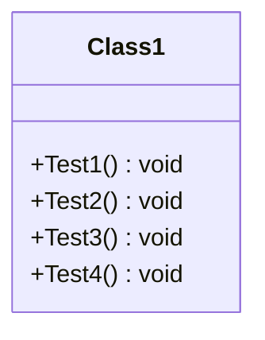

<div id="Data-class-diagram"></div>

##### `Data` class diagram

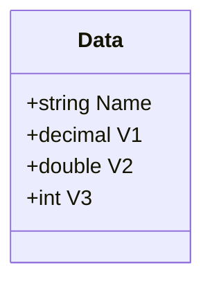

<div id="AuthorizationPolicies-class-diagram"></div>

##### `AuthorizationPolicies` class diagram

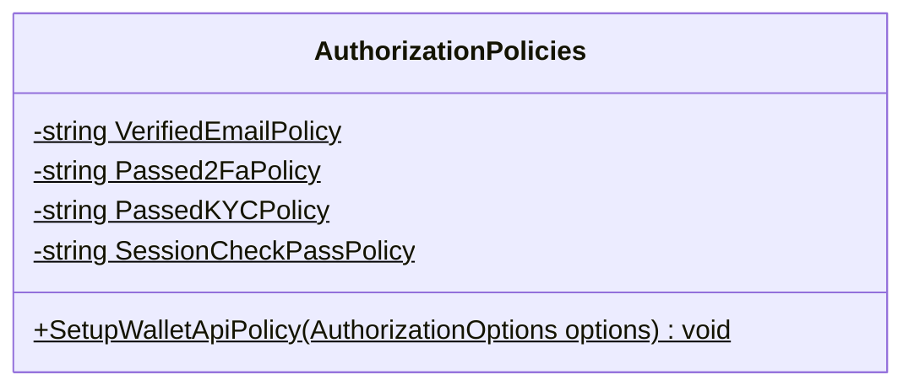

<div id="JetSessionAuthorizeAttribute-class-diagram"></div>

##### `JetSessionAuthorizeAttribute` class diagram

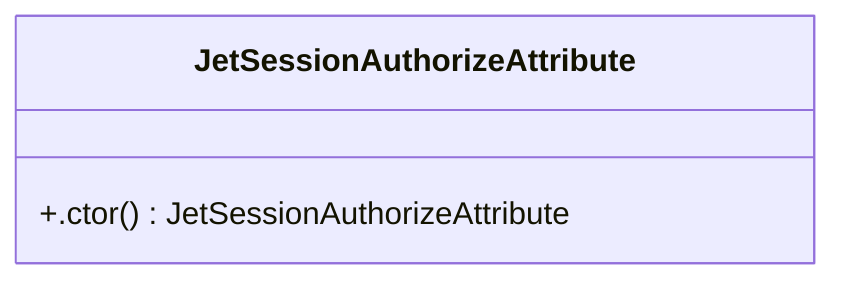

<div id="KYCAuthorizeAttribute-class-diagram"></div>

##### `KYCAuthorizeAttribute` class diagram

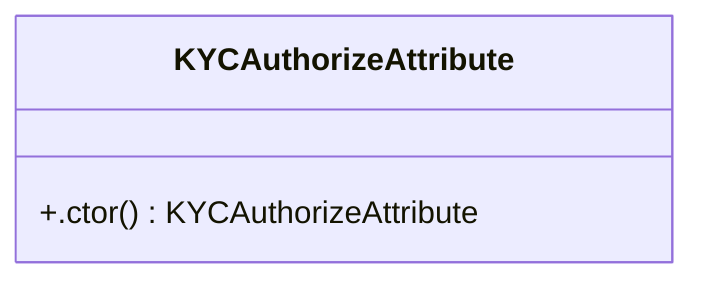

<div id="TwoFaAuthorizeAttribute-class-diagram"></div>

##### `TwoFaAuthorizeAttribute` class diagram

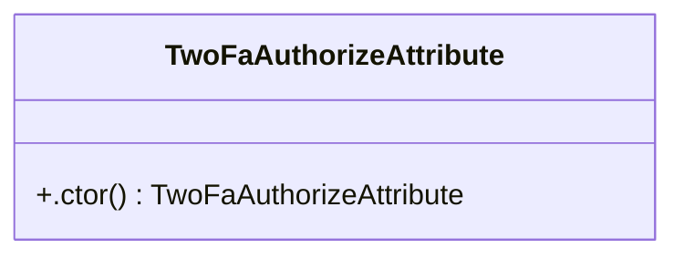

<div id="WalletAuthorizeAttribute-class-diagram"></div>

##### `WalletAuthorizeAttribute` class diagram

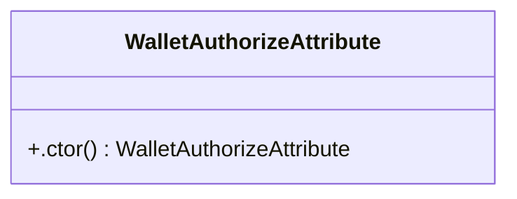

<div id="ApiResponseClassData-class-diagram"></div>

##### `ApiResponseClassData` class diagram

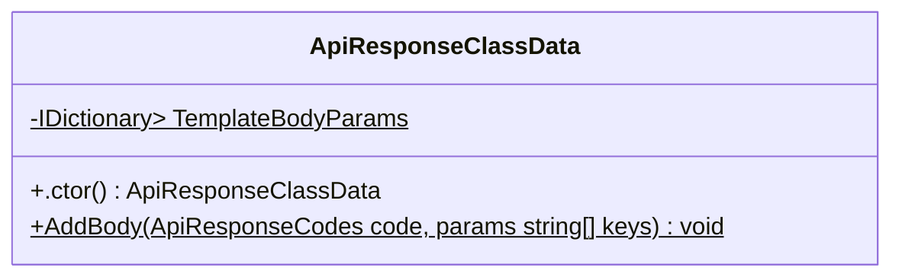

<div id="ApiResponseCodes-class-diagram"></div>

##### `ApiResponseCodes` class diagram

```mermaid
classDiagram
class ApiResponseCodes{
    -OK$
    -InternalServerError$
    -WalletDoNotExist$
    -LowBalance$
    -CannotProcessWithdrawal$
    -AddressIsNotValid$
    -AssetDoNotFound$
    -AssetIsDisabled$
    -AmountIsSmall$
    -InvalidInstrument$
    -KycNotPassed$
    -AssetDoNotSupported$
    -CannotProcessQuoteRequest$
    -CannotExecuteQuoteRequest$
    -NoqEnoughLiquidityForConvert$
    -WithdrawalDoNotFound$
    -CannotResendWithdrawalVerification$
    -PhoneIsNotConfirmed$
    -NotSupported$
    -OperationNotFound$
    -OperationNotAllowed$
    -BlockchainIsNotConfigured$
    -BlockchainIsNotSupported$
    -InvalidPhone$
    -AmountToLarge$
    -OperationUnavailable$
    -InvalidDeletionReasons$
    -InvalidSwapPair$
    -AssetIsNotConfigued$
    -ClientMustBeOlder$
    -ProfileAlreadyExist$
    -AnotherVerificationInProgress$
    -DocumentsNotUploaded$
    -WithdrawalBlocked$
    -TransferBlocked$
    -TradeBlocked$
    -DepositBlocked$
    -LoginBlocked$
    -PhoneNumberUpdateBlocked$
    -BlockchainSendNotSupported$
    -InternalSendNotSupported$
    -BlockchainReceiveNotSupported$
    -LimitExceeded$
    -TradingDisabled$
    -UserExists$
    -CountryIsRestricted$
    -ValidationError$
    -BrandNotFound$
    -InvalidToken$
    -InvalidCode$
    -InvalidRefCode$
    -PinCodeAlreadyExist$
    -SelfieNotExist$
    -WrongPinCodeAttempt$
    -WrongPinCodeBlocked$
    -InvalidKeyId$
    -InvalidEncryptedData$
    -InvalidBillingName$
    -InvalidBillingCity$
    -InvalidBillingCountry$
    -InvalidBillingLine1$
    -InvalidBillingDistrict$
    -InvalidBillingPostalCode$
    -InvalidExpMonth$
    -InvalidExpYear$
    -CardAddressMismatch$
    -CardZipMismatch$
    -CardCvvInvalid$
    -CardExpired$
    -CardFailed$
    -CardNotFound$
    -PaymentFailed$
    -CardFirstAndLastNameCannotBeEmpty$
    -InvalidAccountNumber$
    -InvalidRoutingNumber$
    -InvalidIban$
    -BankAccountNotFound$
    -ExistingRequestId$
    -OperationBlocked$
    -InvalidCardNumber$
    -DisclaimerConfirmRequired$
    -VerificationFailed$
    -VerificationNotSupportedByIssuer$
    -CardInvalid$
    -CardNotHonored$
    -CardAccountIneligible$
    -CardLimitViolated$
    -CardCvvRequired$
    -ThreeDSecureNotSupported$
    -ThreeDSecureActionExpired$
    -ThreeDSecureInvalidRequest$
    -PaymentNotSupportedByIssuer$
    -PaymentNotFunded$
    -PaymentFailedBalanceCheck$
    -CardRestricted$
    -BankAccountIneligible$
    -InvalidWireRtn$
    -RefIdInvalid$
    -AccountNameMismatch$
    -AccountNumberMismatch$
    -AccountIneligible$
    -WalletAddressMismatch$
    -CustomerNameMismatch$
    -InstitutionNameMismatch$
    -TransferFailed$
    -InsufficientFunds$
    -TransactionDenied$
    -TransactionFailed$
    -TransactionReturned$
    -BankTransactionError$
    -FiatAccountLimitExceeded$
    -InvalidBankAccountNumber$
    -InvalidAchRtn$
    -PaymentStoppedByIssuer$
    -PaymentCanceled$
    -PaymentReturned$
    -CreditCardNotAllowed$
    -PaymentMethodUnsupported$
    -VerificationDenied$
    -ThreeDSecureRequired$
    -ThreeDSecureFailure$
    -PaymentFailedDueToPaymentProcessorError$
    -DeclineByBank$
    -CardCountryNotSupported$
    -CardCountryNotSupportedExceptVisa$
    -ClientOfferDisabled$
    -OfferDisabled$
    -ClientOfferFinished$
    -TierNotFound$
    -CannotChangeBalance$
    -TopUpBlocked$
    -ConvertAssetError$
    -ClientOfferNotFound$
    -NftIsNotOnSale$
    -NotEnoughBalanceToCoverFee$
    -InvalidNickname$
    -NicknameUsed$
    -NoNicknameChangesLeft$
    -UnsuccessfulSend$
    -PhoneNotFound$
    -LanguageNotSet$
    -PhoneDuplicate$
    -WrongPinWhenChangingPhone$
}

```

<div id="AttemptsData-class-diagram"></div>

##### `AttemptsData` class diagram

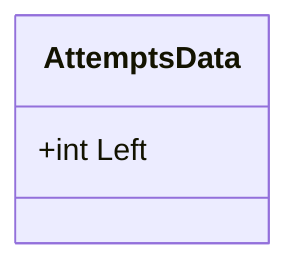

<div id="BlockerAttemptsData-class-diagram"></div>

##### `BlockerAttemptsData` class diagram

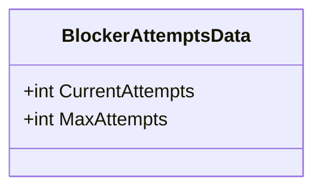

<div id="BlockerExpiredData-class-diagram"></div>

##### `BlockerExpiredData` class diagram

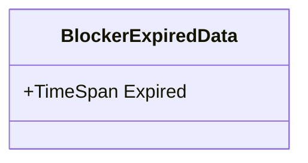

<div id="Response-class-diagram"></div>

##### `Response` class diagram

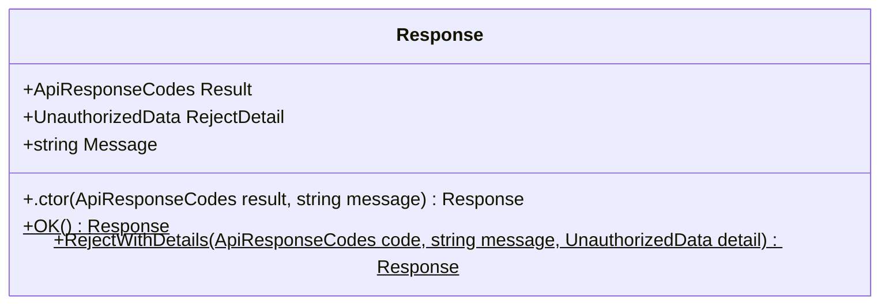

<div id="Response&lt;T&gt;-class-diagram"></div>

##### `Response<T>` class diagram

```mermaid
classDiagram
class Response<T>{
    +T Data
    +nse(T data) void
    +nse(ApiResponseCodes code, string message, T data) void
    +nse(ApiResponseCodes result, string message) void
}

```

<div id="UnauthorizedData-class-diagram"></div>

##### `UnauthorizedData` class diagram

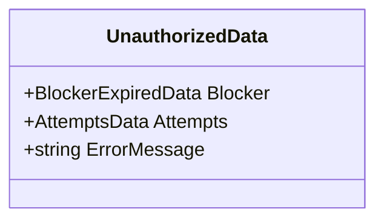

<div id="WalletApiBadRequestException-class-diagram"></div>

##### `WalletApiBadRequestException` class diagram

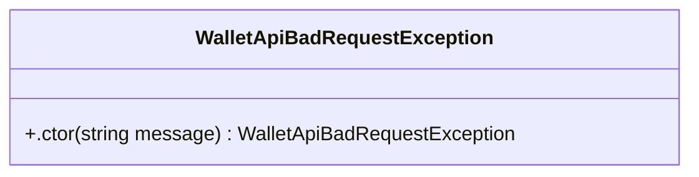

<div id="WalletApiErrorBlockerException-class-diagram"></div>

##### `WalletApiErrorBlockerException` class diagram

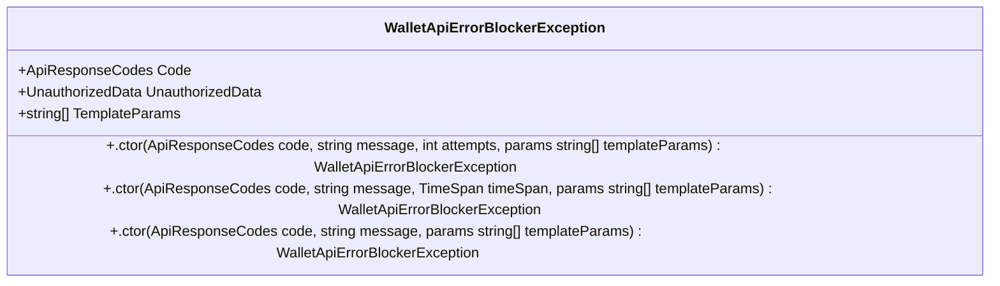

<div id="WalletApiErrorException-class-diagram"></div>

##### `WalletApiErrorException` class diagram

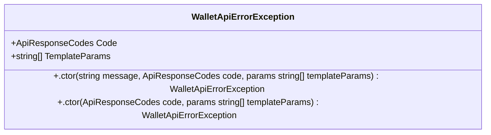

<div id="WalletApiHttpException-class-diagram"></div>

##### `WalletApiHttpException` class diagram

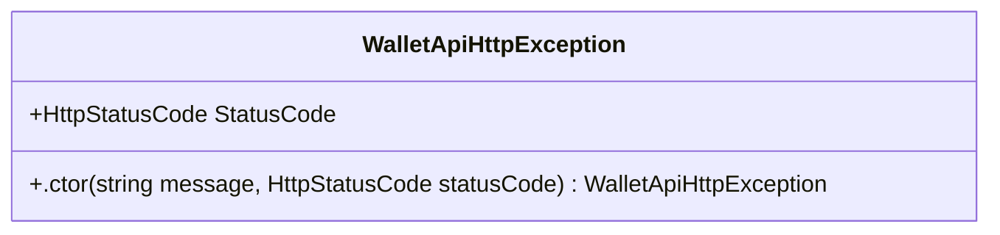

<div id="DebugMiddleware-class-diagram"></div>

##### `DebugMiddleware` class diagram

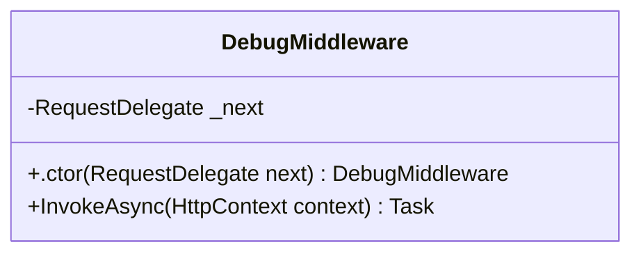

<div id="ExceptionLogMiddleware-class-diagram"></div>

##### `ExceptionLogMiddleware` class diagram

```mermaid
classDiagram
class ExceptionLogMiddleware{
    -string RejectCodeHeader$
    -RequestDelegate _next
    -ILogger<ExceptionLogMiddleware> _logger
    -LocalizationManager _localizationManager
    +.ctor(RequestDelegate next, ILogger<ExceptionLogMiddleware> logger, LocalizationManager localizationManager) ExceptionLogMiddleware
    +InvokeAsync(HttpContext context) Task
}

```

<div id="IPaymentService-class-diagram"></div>

##### `IPaymentService` class diagram

```mermaid
classDiagram
class IPaymentService{
    +GetReceiveMethodsAsync(JetClientIdentity clientId)* ValueTask<List<ReceiveMethodModelDTO>>
    +GetBuyMethodsAsync(JetClientIdentity clientId)* ValueTask<List<BuyMethodModelDTO>>
    +GetSendMethodsAsync(JetClientIdentity clientId)* ValueTask<List<SendMethodModelDTO>>
}

```

<div id="PaymentService-class-diagram"></div>

##### `PaymentService` class diagram

```mermaid
classDiagram
IPaymentService <|-- PaymentService : implements
class PaymentService{
    -IKycStatusClient _kycStatusClient
    -IPaymentMethodV2Client _paymentMethodV2Client
    +.ctor(IKycStatusClient kycStatusClient, IPaymentMethodV2Client paymentMethodV2Client) PaymentService
    +GetReceiveMethodsAsync(JetClientIdentity clientId) ValueTask<List<ReceiveMethodModelDTO>>
    +GetBuyMethodsAsync(JetClientIdentity clientId) ValueTask<List<BuyMethodModelDTO>>
    +GetSendMethodsAsync(JetClientIdentity clientId) ValueTask<List<SendMethodModelDTO>>
}

```

<div id="ControllerUtils-class-diagram"></div>

##### `ControllerUtils` class diagram

```mermaid
classDiagram
class ControllerUtils{
    -string[] IpHeaders$
    +IWalletService WalletService$
    +IApiKeyStorage ApiKeyStorage$
    +PrintToken(string tokenString, string encryptionKeyId)$ Task<string>
    +GetUserAgent11(HttpContext ctx)$ string
    +GetClientIdentity(ControllerBase controller)$ JetClientIdentity
    +ClientIp(ControllerBase controller)$ string
    +ClientRegionInfo(ControllerBase controller)$ RegionInfo
}

```

<div id="LocalizationManager-class-diagram"></div>

##### `LocalizationManager` class diagram

```mermaid
classDiagram
class LocalizationManager{
    -ITemplateService _templateService
    -ITemplateClient _templateClient
    -ILogger<LocalizationManager> _logger
    +.ctor(ITemplateService templateService, ILogger<LocalizationManager> logger, ITemplateClient templateClient) LocalizationManager
    +Start() Task
    +GetTemplateBody(ApiResponseCodes code, HttpContext ctx, params string[] paramValues) Task<string>
}

```

<div id="MyDoubleConverter-class-diagram"></div>

##### `MyDoubleConverter` class diagram

```mermaid
classDiagram
class MyDoubleConverter{
    +Read(ref Utf8JsonReader reader, Type typeToConvert, JsonSerializerOptions options) double
    +Write(Utf8JsonWriter writer, double value, JsonSerializerOptions options) void
}

```

<div id="StartupUtils-class-diagram"></div>

##### `StartupUtils` class diagram

```mermaid
classDiagram
class StartupUtils{
    +SetupSwaggerDocumentation(IServiceCollection services)$ void
    +ConfigurateHeaders(IServiceCollection services)$ void
    +SetupWalletServices(IServiceCollection services, string sessionEncryptionApiKeyId)$ void
    +SetupSimpleServices(IServiceCollection services, string sessionEncryptionApiKeyId)$ void
    +SetupWalletApplication(IApplicationBuilder app, IWebHostEnvironment env, bool enableApiTrace, string swaggerOffsetName)$ void
    +RegisterAuthServices(ContainerBuilder builder, string readerHostPort, ILoggerFactory loggerFactory)$ void
}

```

<div id="UserAgentUtils-class-diagram"></div>

##### `UserAgentUtils` class diagram

```mermaid
classDiagram
class UserAgentUtils{
    -string UserAgent$
    -string Ipcountry$
    +GetGeolocationByIp(HttpContext ctx)$ string
    +GetRowUserAgent(HttpContext ctx)$ string
    +GetLang(HttpContext ctx)$ string
    +GetPhoneModel(HttpContext ctx)$ string
    +GetCountryFull(HttpContext ctx)$ string
    +GetDeviceUid(HttpContext ctx)$ string
    +GetDevicePlatform(HttpContext ctx)$ string
    +GetClientApplicationVersion(HttpContext ctx)$ string
    +GetInstallationId(HttpContext ctx)$ string
}

```

<div id="IWalletService-class-diagram"></div>

##### `IWalletService` class diagram

```mermaid
classDiagram
class IWalletService{
    +GetWalletsAsync(JetClientIdentity clientId)* ValueTask<List<ClientWallet>>
    +GetDefaultWalletAsync(JetClientIdentity clientId)* ValueTask<ClientWallet>
    +GetWalletByIdAsync(JetClientIdentity clientId, string walletId)* ValueTask<ClientWallet>
    +SetBaseAssetAsync(JetClientIdentity clientId, string walletId, string baseAsset)* ValueTask<bool>
    +GetWalletIdentityByIdAsync(JetClientIdentity clientId, string walletId)* ValueTask<JetWalletIdentity>
}

```

<div id="WalletService-class-diagram"></div>

##### `WalletService` class diagram

```mermaid
classDiagram
IWalletService <|-- WalletService : implements
class WalletService{
    -IClientWalletService _clientWalletService
    -ILogger<WalletService> _logger
    +.ctor(IClientWalletService clientWalletService, ILogger<WalletService> logger) WalletService
    +GetWalletsAsync(JetClientIdentity clientId) ValueTask<List<ClientWallet>>
    +GetDefaultWalletAsync(JetClientIdentity clientId) ValueTask<ClientWallet>
    +GetWalletByIdAsync(JetClientIdentity clientId, string walletId) ValueTask<ClientWallet>
    +SetBaseAssetAsync(JetClientIdentity clientId, string walletId, string baseAsset) ValueTask<bool>
    +GetWalletIdentityByIdAsync(JetClientIdentity clientId, string walletId) ValueTask<JetWalletIdentity>
}

```

*This file is maintained by a bot.*

<!-- markdownlint-restore -->
